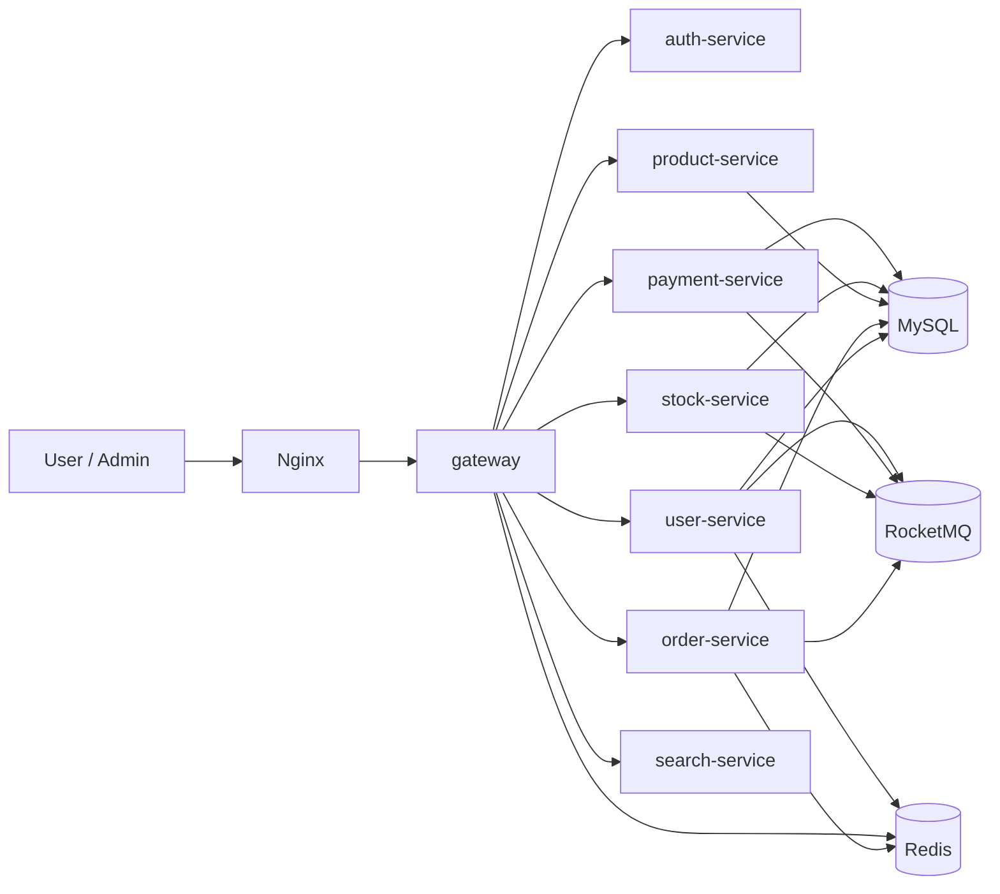
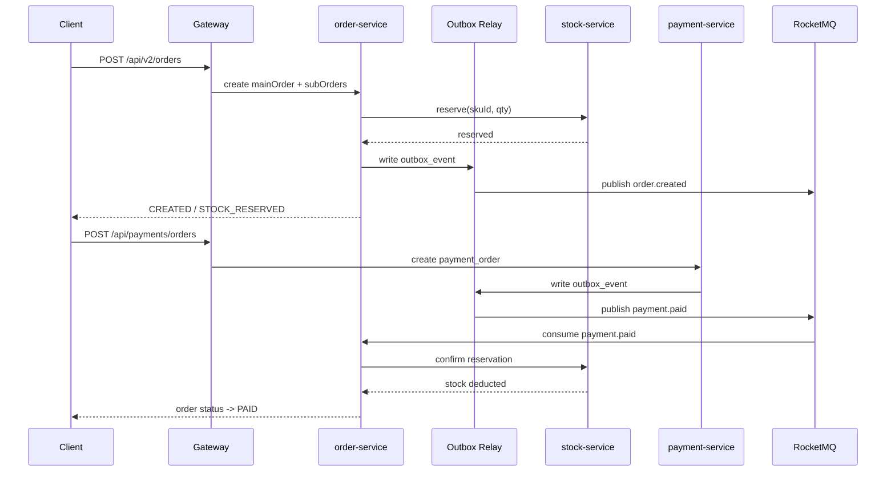
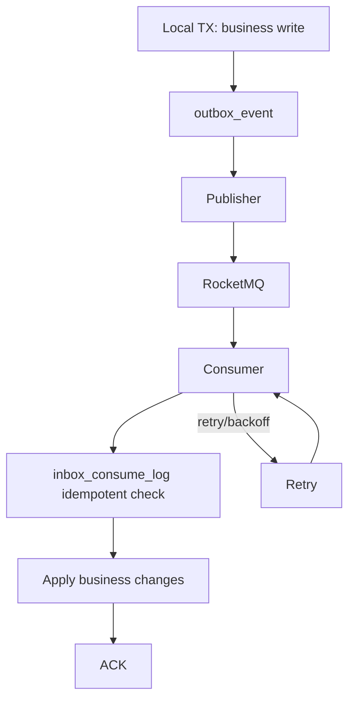
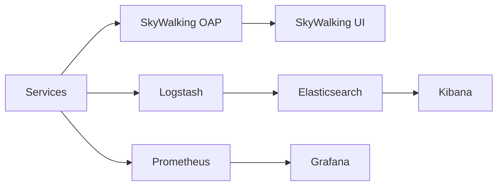

# Cloud Shop Microservices
Version: 1.1.0

[English](./README.md)

简化版电商微服务项目，后端基于 Spring Boot + Spring Cloud Alibaba，前端为 Vue 3 + TypeScript。

## 当前一致性与消息模式

- 订单/支付/库存采用本地事务 + `outbox_event` 可靠投递
- Outbox 由 `order/payment/stock` 服务内部定时轮询发布到 RocketMQ
- 消费端使用 Redis 幂等（`MessageIdempotencyService`）防重
- 用户通知改为 RocketMQ 异步投递（`user-notification` 主题），失败会触发重试
- Seata 依赖/配置保留，但当前代码未使用 `@GlobalTransactional`，`payment-service` 配置中已关闭 Seata

## 模块与端口

| 模块 | 端口 | 说明 |
| --- | --- | --- |
| `gateway` | `8080` | 统一网关，转发 `/api/**`、`/auth/**` |
| `auth-service` | `8081` | OAuth2/JWT 认证与 GitHub 登录 |
| `user-service` | `8082` | 用户、商家（启用/审核状态）、管理员、资料与地址 |
| `order-service` | `8083` | 订单与退款 |
| `product-service` | `8084` | 商品与分类 |
| `stock-service` | `8085` | 库存与库存变更 |
| `payment-service` | `8086` | 支付与支付宝接口 |
| `search-service` | `8087` | Elasticsearch 搜索 |
| `my-shop-web` | `5173`(dev) | Web/Android/iOS 前端 |

## 快速启动

1. 启动基础依赖（含端口占用清理）：

```bash
bash scripts/dev/start-containers.sh
# 兼容 Windows PowerShell:
# powershell -File scripts/dev/start-containers.ps1
```

可选：启动完整监控栈（Prometheus + Grafana + exporters）：

```bash
bash scripts/dev/start-containers.sh --with-monitoring
# 兼容 Windows PowerShell:
# powershell -File scripts/dev/start-containers.ps1 --with-monitoring
```

一键启动（容器 + 服务）：

```bash
bash scripts/dev/start-platform.sh --with-monitoring
# 兼容 Windows PowerShell:
# powershell -File scripts/dev/start-platform.ps1 --with-monitoring
```

兼容命令别名：

```bash
bash scripts/dev/start-all.sh --with-monitoring
# 兼容 Windows PowerShell:
# powershell -File scripts/dev/start-all.ps1 --with-monitoring
```

2. 初始化数据库（先 `init` 再 `test`，可选）：见 `db/README.md`。

   说明（当前封闭开发期默认策略）：
   - MySQL 容器每次启动都会清空 `/var/lib/mysql` 后重建。
   - 启动时会自动顺序执行 `db/init/**/*.sql` 与 `db/test/**/*.sql`。
   - 不保留历史数据，不做迁移兼容。

3. 构建后端：

```bash
mvn -T 1C clean package -DskipTests
```

4. 启动后端服务（含端口占用清理）：

```bash
bash scripts/dev/start-services.sh
# 兼容 Windows PowerShell:
# powershell -File scripts/dev/start-services.ps1
```

说明：服务交互参数统一由 Nacos `common.yaml` 配置中心下发，不依赖启动脚本外部注入。
补充：直接执行 `start-services.*` 时，脚本会自动注入本地开发环境所需的基础地址和默认 key/secret，例如 `GATEWAY_SIGNATURE_SECRET`、`CLIENT_SERVICE_SECRET`、`APP_OAUTH2_*_CLIENT_SECRET`、`APP_JWT_ALLOW_GENERATED_KEYPAIR`。
补充：`start-platform.*` / `start-services.*` 也会默认自动接入 SkyWalking，首次会把 agent 下载并缓存到 `.tmp/skywalking/`，随后所有 Java 服务会自动注入 `javaagent`，方便在 SkyWalking UI 里查 HTTP、Dubbo、Redis、JDBC/MyBatis 链路。

5. 构建前端并部署到 Nginx 静态目录：

```bash
pnpm --dir my-shop-web install
pnpm --dir my-shop-web build
```

将 `my-shop-web/dist` 内容拷贝到 `docker/docker-compose/nginx/html/` 后重启 `nginx` 容器。

## 常用入口

- 前端首页：`http://127.0.0.1:18080`
- 网关 API 文档：`http://127.0.0.1:18080/doc.html`
- Nacos：`http://127.0.0.1:18080/nacos`
- RocketMQ Dashboard：`http://127.0.0.1:38082`
- MinIO Console：`http://127.0.0.1:19001`
- Elasticsearch：`http://127.0.0.1:19200`
- Kibana：`http://127.0.0.1:15601`
- Prometheus：`http://127.0.0.1:19099`
- Grafana：`http://127.0.0.1:13000`
- SkyWalking UI：`http://127.0.0.1:13001`
- Sentinel Dashboard：`http://127.0.0.1:18718`

## 搜索接入策略

- 前端统一调用网关搜索入口：`/api/search/**`。
- 网关对以下接口启用 700ms 超时降级：`/api/search/smart-search`、`/api/search/search`、`/api/search/suggestions`。
- 当 `search-service` 超时或异常时，网关自动回退到 `product-service` 只读接口，不需要前端做多服务兜底。
- 关键词推荐建议优先调用：
  - `/api/search/suggestions`
  - `/api/search/hot-keywords`
  - `/api/search/keyword-recommendations`

## 测试环境（testenv）

- 使用 `testenv` profile 时，网关与各业务服务会关闭 JWT 校验并放开接口权限，仅用于全链路联调。
- 启动方式示例：
  - `mvn -pl gateway spring-boot:run -Dspring-boot.run.profiles=testenv`
  - `mvn -pl user-service spring-boot:run -Dspring-boot.run.profiles=testenv`
- 已内置永久测试 token（数据库初始化写入）：
  - token 值：`TEST_ENV_PERMANENT_TOKEN`
  - 存储表：`user_db.test_access_token`
  - 过期时间：`2099-12-31 23:59:59`

## Druid / SkyWalking / xxl-job

- Druid：
  - 已切换为 `com.alibaba.druid.pool.DruidDataSource`。
  - 常用环境变量：`DB_POOL_SIZE`、`DB_MIN_IDLE`、`DB_CONNECTION_TIMEOUT`。
- SkyWalking：
  - 启动脚本默认自动注入 `javaagent`，首次会下载并缓存到 `.tmp/skywalking/`。
  - 可用 `SKYWALKING_AUTO_ENABLE=false` 关闭自动接入。
  - 可通过 `SKYWALKING_AGENT_PATH` 指定自定义 agent jar。
  - 可选设置 `SKYWALKING_COLLECTOR_BACKEND_SERVICE`（默认 `127.0.0.1:11800`）。
  - agent 日志写入 `.tmp/service-runtime/<service>/skywalking-agent/`。
- xxl-job：
  - 已内置执行器自动配置，默认关闭。
  - 通过 `XXL_JOB_ENABLED=true` 启用。
  - 常用参数：`XXL_JOB_ADMIN_ADDRESSES`、`XXL_JOB_APPNAME`、`XXL_JOB_ACCESS_TOKEN`、`XXL_JOB_PORT`。
- 消息可靠投递：`order/payment/stock` 采用 `outbox_event` + 定时 Relay 发送到 RocketMQ


## Sentinel 断路器（网关）

- 已在 `gateway` 引入 Sentinel 并加载网关规则，默认保护以下路由：
  - `user-service-api-v2`
  - `product-service-api-v2`
  - `order-service-api-v2`
  - `payment-service-api-v2`
  - `stock-service-api-v2`
  - `search-service-api-v2`
- 默认阈值：`80 QPS / 1s`（可通过环境变量覆盖）。
- 触发规则后返回 `429`，响应体为统一 JSON 错误结构。
- 本地控制台：`docker compose` 已新增 `sentinel-dashboard`，访问 `http://127.0.0.1:18718`。

## MySQL 索引规范

- 命名规范：
  - 唯一索引：`uk_<table>_<cols>`
  - 普通索引：`idx_<table>_<cols>`
- 设计规范：
  - 组合索引按“高选择性等值列 -> 状态/逻辑删除列 -> 排序列”顺序。
  - 逻辑删除表（`deleted`/`is_deleted`）的高频查询索引需包含删除标记列。
  - 避免重复/冗余索引，避免仅为低区分度单列（如 `status`）单独建索引。
- 当前仓库 `db/init/*/init.sql` 已按以上规范统一。

## 服务间鉴权（已采用 API Key）

- 方案选择：`API Key`（未采用 mTLS）。
- 生效范围：所有 `/internal/**` 接口。
- 请求头：
  - `X-Internal-Api-Key`
  - `X-Internal-Caller`
- Dubbo 内部 RPC 已替代 Feign；`/internal/**` HTTP 端点仅作为调试/回归通道保留。
- 统一环境变量：`INTERNAL_API_KEY`（示例见 `docker/.env`）。

## 架构图（Mermaid）

### 1) 系统拓扑



### 2) 下单到履约主链路（主单/子单）



### 3) 可靠消息最终一致（Outbox + Inbox）



### 4) 可观测性链路



## 目录说明

- `db/`：初始化、测试数据与归档 SQL
- `docker/`：容器与基础设施配置
- `tests/perf/k6/`：主链路压测脚本
- `docs/`：运维与排障文档
- `docs/code-audit-2026-03-13-zh.md`：2026-03-13 后端代码审查与修复记录（中文）
- `docs/code-audit-2026-03-13-en.md`：2026-03-13 后端代码审查与修复记录（英文）
- `docs/project-closeout.md`：项目暂停前的冻结状态与恢复顺序
- `docs/performance-baseline.md`：本地性能基线、瓶颈说明与回归口径
- `docs/TEST_SCRIPT_INDEX.md`：测试脚本入口索引
