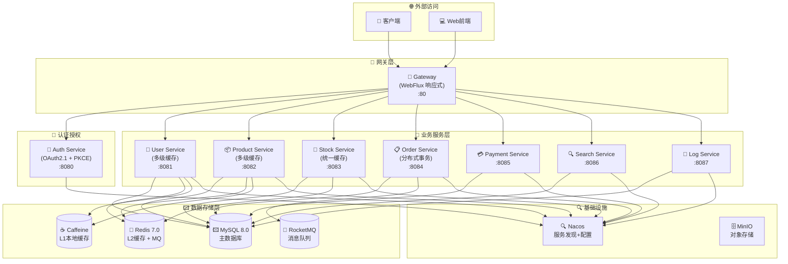
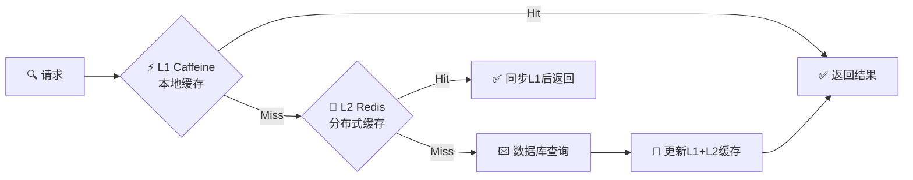

# 🌐 Cloud 微服务平台

<div align="center">


**现代化企业级微服务架构平台**

基于 Spring Boot 3.x + Spring Cloud 2025 + OAuth2.1 构建的高性能、高可用、可扩展的企业级微服务解决方案

</div>

## 🚀 项目特色

### 🏗️ 现代化架构
- ✨ **Spring Boot 3.5.3** - 最新稳定版，原生Java 17支持
- 🌍 **Spring Cloud 2025.0.0** - 下一代云原生架构
- 🔐 **OAuth2.1标准** - 完整实现授权服务器和资源服务器
- ⚡ **WebFlux响应式** - 高并发响应式网关

### 📊 性能优化
- 💾 **多级缓存** - L1(Caffeine) + L2(Redis)双层缓存
- 🚀 **缓存策略** - 按业务选择多级或Redis统一缓存
- 🔗 **连接池调优** - HikariCP高性能数据库连接
- 🏃 **异步处理** - CompletableFuture异步编程

### 🔒 安全保障
- 📱 **PKCE增强** - 移动端安全增强
- 🎩 **JWT全生命周期** - 生成、刷新、撤销管理
- 🚪 **网关统一鉴权** - 所有API请求统一安全验证
- 📝 **细粒度权限** - 方法级@PreAuthorize权限控制

### ⚙️ 开发效率
- 🛠️ **Common Module v2.0** - 统一基础配置、异常处理
- 🔄 **代码生成** - MapStruct自动对象映射
- 📚 **文档自动化** - Knife4j + SpringDoc API文档
- 🎁 **响应标准化** - Result<T>和PageResult<T>统一格式

## 📊 技术栈版本

### 🔥 核心框架

| 组件 | 版本 | 说明 |
|------|------|------|
| Spring Boot | 3.5.3 | 主框架，最新稳定版 |
| Spring Cloud | 2025.0.0 | 云原生微服务架构 |
| Spring Cloud Alibaba | 2025.0.0.0-preview | 阿里云微服务组件 |
| Java | 17 | LTS长期支持版本 |

### 🗾️ 数据存储

| 组件 | 版本 | 说明 |
|------|------|------|
| MySQL | 8.0+ | 主数据库，支持JSON和GIS |
| Redis | 7.0+ | 缓存与消息队列 |
| MyBatis Plus | 3.5.13 | ORM框架，代码生成 |
| HikariCP | 5.1.0 | 高性能数据库连接池 |
| Caffeine | 3.2.2 | 本地缓存L1层 |

### 🛠️ 工具类库

| 组件 | 版本 | 说明 |
|------|------|------|
| MapStruct | 1.6.3 | 自动对象映射，高性能 |
| Lombok | Boot管理 | 代码生成工具 |
| Jackson | Boot管理 | JSON序列化框架 |
| Jakarta Validation | Boot管理 | Bean校验框架 |
| FastJSON2 | 2.0.58 | 阿里高性能JSON |

### 📨 消息队列

| 组件 | 版本 | 说明 |
|------|------|------|
| RocketMQ | 5.3.2 | 阿里云原生消息中间件 |
| Spring Cloud Stream | Alibaba管理 | 消息驱动微服务框架 |

### 📚 API文档

| 组件 | 版本 | 说明 |
|------|------|------|
| Knife4j | 4.5.0 | 增强Swagger UI界面 |
| SpringDoc | 2.2.34 | OpenAPI 3.0文档生成 |

### 🔍 服务发现与配置

| 组件 | 版本 | 说明 |
|------|------|------|
| Nacos | Alibaba管理 | 服务发现和配置中心 |
| OpenFeign | 4.3.0 | 声明式REST客户端 |
| Spring Cloud LoadBalancer | Cloud管理 | 客户端负载均衡 |

### 🔐 安全框架

| 组件 | 版本 | 说明 |
|------|------|------|
| Spring Security | Boot管理 | 安全认证授权框架 |
| OAuth2 Resource Server | Boot管理 | OAuth2.1资源服务器 |
| JWT | Boot管理 | JSON Web Token支持 |

### 📄 日志框架

| 组件 | 版本 | 说明 |
|------|------|------|
| SLF4J | 2.0.16 | 日志门面抽象层 |
| Logback | 1.5.13 | 高性能日志实现 |
| Micrometer | Boot管理 | 应用监控指标 |

### 📎 其他工具

| 组件 | 版本 | 说明 |
|------|------|------|
| MinIO | 8.5.17 | 对象存储服务 |
| Kotlin Reflect | 1.9.24 | Kotlin反射支持 |

## 📊 服务架构图



## 📋 服务状态概览

| 服务名称 | 状态 | 端口 | 主要功能 | 技术特性 |
|----------|------|------|----------|----------|
| Gateway | ✅ 完成 | 80 | 响应式网关、统一鉴权 | WebFlux + OAuth2.1 |
| Auth Service | ✅ 完成 | 8080 | OAuth2.1授权服务器 | PKCE + JWT全生命周期 |
| User Service | ✅ 完成 | 8081 | 用户管理、权限控制 | 多级缓存(L1+L2) |
| Product Service | ✅ 完成 | 8082 | 商品管理、分类管理 | 多级缓存(L1+L2) |
| Stock Service | ✅ 完成 | 8083 | 库存管理、库存扣减 | Redis统一缓存 |
| Order Service | ✅ 完成 | 8084 | 订单管理、分布式事务 | Seata + RocketMQ |
| Payment Service | 🟡 开发中 | 8085 | 支付管理、支付回调 | 第三方支付集成 |
| Search Service | 🟡 开发中 | 8086 | 搜索服务、索引管理 | Elasticsearch |
| Log Service | 🟡 开发中 | 8087 | 日志收集、分析统计 | 异步日志处理 |

## 📁 项目结构规范

### 1. 🏗️ 顶层项目结构

```
cloud/
├── 🛠️ common-module/         # Common Module v2.0 (已全面重构)
│   ├── config/            # 🧩 统一基础配置 (数据库、缓存、安全)
│   ├── domain/            # 📜 统一DTO/VO管理 (Result<T>, PageResult<T>)
│   ├── exception/         # ⚠️ 统一异常处理与全局拦截
│   ├── utils/             # 🛠️ 通用工具类集
│   └── REFACTOR_GUIDE.md  # 📚 v2.0重构使用指南
├── 🔌 api-module/           # API定义模块 (Feign接口)
├── 🚪 gateway/              # 响应式网关 (WebFlux + OAuth2.1)
├── 🔐 auth-service/         # OAuth2.1授权服务器 (PKCE + JWT)
├── 👤 user-service/         # 用户服务 (多级缓存)
├── 📦 product-service/      # 商品服务 (多级缓存)
├── 📎 stock-service/        # 库存服务 (Redis统一缓存)
├── 📋 order-service/        # 订单服务 (分布式事务)
├── 💳 payment-service/      # 支付服务 (第三方集成)
├── 🔍 search-service/       # 搜索服务 (Elasticsearch)
├── 📄 log-service/          # 日志服务 (异步处理)
├── 📊 sql/                  # 数据库SQL脚本集
└── 🛠️ pom.xml              # 父级POM文件
```

### 🚀 Common Module v2.0 重构亮点

✨ **统一基础配置** - 所有服务共享数据库、缓存、安全配置  
🎩 **全局异常处理** - 统一异常捕获、响应格式化  
📜 **响应标准化** - Result<T>和PageResult<T>统一响应格式  
🛠️ **工具类集** - 日期、字符串、加密等通用工具  
📚 **使用指南** - 详细的v2.0重构使用文档

### 2. 💼 单个服务目录结构

```
service-name/
├── src/main/java/com/cloud/{service}/
│   ├── {Service}Application.java     # 🚀 启动类
│   ├── config/                       # ⚙️ 服务专用配置
│   │   ├── CacheConfig.java          # 💾 缓存策略配置
│   │   ├── SecurityConfig.java       # 🔒 OAuth2资源服务器
│   │   └── SwaggerConfig.java        # 📚 Knife4j API文档
│   ├── controller/                   # 🎯 控制器层 (按功能分包)
│   │   ├── query/                    # 🔍 查询API控制器
│   │   └── manage/                   # 🖼️ 管理API控制器
│   ├── service/                      # 💼 业务服务层
│   │   ├── I{Business}Service.java   # 接口定义
│   │   └── impl/                     # 实现类
│   ├── mapper/                       # 🖾️ MyBatis数据访问层
│   ├── entity/                       # 📊 数据库实体类
│   ├── dto/                         # 📦 数据传输对象
│   │   ├── request/                  # 请求DTO
│   │   └── response/                 # 响应DTO
│   ├── vo/                          # 🎨 视图对象 (经 Common Module标准化)
│   ├── converter/                   # 🔄 MapStruct对象转换器
│   ├── enums/                       # 🏷️ 业务枚举类
│   ├── aspect/                      # ✂️ AOP切面 (日志、缓存、权限)
│   └── cache/                       # 💾 缓存管理 (L1+L2策略)
└── src/main/resources/
    ├── application.yml              # 📄 服务配置文件
    ├── mapper/                      # 🗺️ MyBatis XML映射文件
    └── static/                      # 📎 静态资源文件
```

## 📝 代码规范标准

### 🎨 最新开发规范亮点

✨ **Common Module v2.0集成** - 所有服务统一继承基础配置  
🔐 **OAuth2.1资源服务器** - 所有服务统一鉴权模式  
💾 **缓存策略分层** - L1+L2多级缓存和Redis统一缓存  
📜 **响应标准化** - Result<T>和PageResult<T>统一返回  
📚 **API文档自动化** - Knife4j + SpringDoc自动生成

### 1. 命名规范

#### 包命名

- **格式**: `com.cloud.{service}.{module}`
- **示例**: `com.cloud.user.service`, `com.cloud.product.controller`
- **规则**: 全小写，单词间用点分隔

#### 类命名

- **Controller**: `{业务}Controller`, `{业务}QueryController`, `{业务}ManageController`
- **Service**: `{业务}Service`, `{业务}ServiceImpl`
- **Entity**: 实体名称，如`User`, `Product`
- **DTO**: `{业务}RequestDTO`, `{业务}PageDTO`, `{业务}DTO`
- **VO**: `{业务}VO`
- **Converter**: `{业务}Converter`
- **Exception**: `{业务}Exception`, `{业务}NotFoundException`

#### 方法命名

- **查询方法**: `get{Object}`, `find{Object}`, `list{Object}`, `page{Object}`
- **创建方法**: `create{Object}`, `add{Object}`, `save{Object}`
- **更新方法**: `update{Object}`, `modify{Object}`
- **删除方法**: `delete{Object}`, `remove{Object}`
- **校验方法**: `validate{Object}`, `check{Object}`

#### 字段命名

- **变量**: 小驼峰命名，如`userId`, `productName`
- **常量**: 全大写，下划线分隔，如`MAX_SIZE`, `DEFAULT_TIMEOUT`
- **数据库字段**: 下划线命名，如`user_id`, `create_time`

### 2. 注解规范

#### 🔄 Controller层最新注解规范

```java
@RestController
@RequestMapping("/api/v1/users")
@RequiredArgsConstructor
@Validated
@Tag(name = "👤 用户管理", description = "用户相关功能接口")
@PreAuthorize("hasAnyAuthority('ROLE_USER', 'ROLE_ADMIN')")
public class UserController {
    
    @Operation(summary = "获取用户信息", description = "根据ID查询用户详细信息")
    @GetMapping("/{id}")
    @PreAuthorize("#id == authentication.principal.userId or hasRole('ADMIN')")
    public Result<UserVO> getUser(
        @Parameter(description = "用户ID", example = "1001") 
        @PathVariable Long id) {
        // 使用Common Module统一响应格式
        return Result.success(userService.getUserById(id));
    }
    
    @Operation(summary = "分页查询用户", description = "管理员分页查询用户列表")
    @PostMapping("/page")
    @PreAuthorize("hasRole('ADMIN')")
    public Result<PageResult<UserVO>> pageUsers(
        @Valid @RequestBody UserPageRequest request) {
        // 使用Common Module统一分页格式  
        return Result.success(userService.pageUsers(request));
    }
}
```

#### 💼 Service层最新规范

```java
@Service
@RequiredArgsConstructor
@Slf4j
@Transactional(readOnly = true)
public class UserServiceImpl implements IUserService {
    
    private final UserMapper userMapper;
    private final UserCacheManager userCacheManager; // 多级缓存管理
    private final UserConverter userConverter; // MapStruct转换器
    
    @Override
    @Cacheable(cacheNames = "user", key = "#id", cacheManager = "multiLevelCacheManager")
    public UserVO getUserById(Long id) {
        User user = userMapper.selectById(id);
        if (user == null) {
            throw new UserNotFoundException("用户不存在: " + id);
        }
        return userConverter.toVO(user);
    }
    
    @Override
    public PageResult<UserVO> pageUsers(UserPageRequest request) {
        // 使用Common Module的PageResult统一分页
        Page<User> page = userMapper.selectPage(
            new Page<>(request.getPageNum(), request.getPageSize()),
            new QueryWrapper<User>().like("username", request.getKeyword())
        );
        return PageResult.of(page, userConverter::toVO);
    }
    
    @Override
    @Transactional
    @CacheEvict(cacheNames = "user", key = "#user.id")
    public void updateUser(User user) {
        userMapper.updateById(user);
        log.info("用户信息更新成功: {}", user.getId());
    }
}
```
    
    @GetMapping("/{id}")
    @Operation(summary = "获取用户详情", description = "根据用户ID获取用户详细信息")
    @PreAuthorize("hasAuthority('USER_VIEW')")
    public Result<UserVO> getUserById(@PathVariable @Valid @Positive Long id) {
        // 方法实现
    }
}
```

#### Service层注解

```java
@Service
@Slf4j
@RequiredArgsConstructor
@Transactional(readOnly = true)
public class UserServiceImpl implements UserService {
    
    @Override
    @Transactional(rollbackFor = Exception.class)
    @MultiLevelCachePut(value = "userCache", key = "#result.id")
    public UserVO createUser(UserRequestDTO requestDTO) {
        // 方法实现
    }
}
```

#### 缓存注解规范

```java
// 查询缓存
@MultiLevelCacheable(value = "userCache", key = "#id", expire = 60, timeUnit = TimeUnit.MINUTES)

// 更新缓存
@MultiLevelCachePut(value = "userCache", key = "#id", expire = 60, timeUnit = TimeUnit.MINUTES)

// 清除缓存
@MultiLevelCacheEvict(value = "userCache", key = "#id")

// 组合缓存操作
@MultiLevelCaching(
    put = @MultiLevelCachePut(value = "userCache", key = "#result.id"),
    evict = @MultiLevelCacheEvict(value = "userListCache", allEntries = true)
)
```

## 🚀 新架构亮点展示

### 🎩 统一响应格式 (Common Module v2.0)

#### 成功响应示例
```json
{
  "success": true,
  "code": 200,
  "message": "请求成功",
  "data": {
    "id": 1001,
    "username": "admin",
    "email": "admin@cloud.com"
  },
  "timestamp": "2024-12-19T10:30:00"
}
```

#### 分页响应示例 (PageResult<T>)
```json
{
  "success": true,
  "code": 200,
  "message": "请求成功",
  "data": {
    "records": [/* 数据列表 */],
    "total": 156,
    "pageNum": 1,
    "pageSize": 20,
    "pages": 8,
    "hasNext": true,
    "hasPrevious": false
  },
  "timestamp": "2024-12-19T10:30:00"
}
```

### ⚠️ 统一异常处理规范

#### 异常响应示例
```json
{
  "success": false,
  "code": 404,
  "message": "用户不存在",
  "data": null,
  "timestamp": "2024-12-19T10:30:00",
  "path": "/api/v1/users/999"
}
```

## 💾 多级缓存策略

### 🚀 缓存架构设计



### 🏆 服务缓存策略选择

| 服务 | 缓存策略 | 理由 | TTL设置 |
|------|----------|------|--------|
| User Service | L1+L2多级 | 高频访问，稳定数据 | 30min/2h |
| Product Service | L1+L2多级 | 热点商品，可能更新 | 15min/1h |
| Stock Service | Redis统一 | 需实时一致性 | 5min |
| Order Service | 不使用缓存 | 实时事务数据 | - |

## 🚀 快速开始

### 📍 环境准备

```bash
# 1. 基本环境要求
Java 17+
Maven 3.8+
MySQL 8.0+
Redis 7.0+
Nacos 2.4.0+
```

### 📦 服务启动顺序

```bash
# 1. 启动基础设施
docker-compose up -d mysql redis nacos

# 2. 启动核心服务
mvn spring-boot:run -pl auth-service   # OAuth2.1授权服务器
mvn spring-boot:run -pl gateway        # 响应式网关

# 3. 启动业务服务
mvn spring-boot:run -pl user-service
mvn spring-boot:run -pl product-service
mvn spring-boot:run -pl stock-service
mvn spring-boot:run -pl order-service
```

### 📚 文档地址

- **📊 架构文档**: [ARCHITECTURE.md](ARCHITECTURE.md)
- **📋 服务状态**: [SERVICE_STATUS.md](SERVICE_STATUS.md)
- **🚀 快速开始**: [QUICK_START.md](QUICK_START.md)
- **📝 开发规范**: [RULE.md](RULE.md)
- **📚 API文档**: http://localhost/doc.html

### 🏅 最新成就

✅ **网关服务重构** - WebFlux响应式 + 统一鉴权  
✅ **OAuth2.1完整实现** - PKCE + JWT全生命周期  
✅ **多级缓存优化** - L1+L2策略 + Redis统一  
✅ **Common Module v2.0** - 统一基础配置与异常  
✅ **库存服务修复** - 库存一致性保障  
✅ **分布式事务** - 订单服务事务管理

---

<div align="center">

**⚡ 高性能 · 🔒 安全稳定 · 🚀 快速开发**

*由 Spring Boot 3.5.3 + Spring Cloud 2025 + OAuth2.1 驱动*

</div>

#### 全局异常处理器

```java
@Slf4j
@RestControllerAdvice
public class GlobalExceptionHandler {
    
    @ExceptionHandler(MethodArgumentNotValidException.class)
    @ResponseStatus(HttpStatus.BAD_REQUEST)
    public Result<String> handleValidationException(MethodArgumentNotValidException ex) {
        // 处理参数校验异常
    }
    
    @ExceptionHandler(BusinessException.class)
    @ResponseStatus(HttpStatus.INTERNAL_SERVER_ERROR)
    public Result<String> handleBusinessException(BusinessException ex) {
        // 处理业务异常
    }
}
```

#### 自定义业务异常

```java
public class UserNotFoundException extends RuntimeException {
    public UserNotFoundException(Long userId) {
        super("用户不存在: " + userId);
    }
}
```

### 4. 统一响应格式

#### 成功响应

```json
{
    "code": 200,
    "message": "操作成功",
    "data": {
        // 具体数据
    },
    "timestamp": 1640995200000
}
```

#### 错误响应

```json
{
    "code": 400,
    "message": "参数校验失败: 用户名不能为空",
    "data": null,
    "timestamp": 1640995200000
}
```

#### 分页响应

```json
{
    "code": 200,
    "message": "操作成功",
    "data": {
        "records": [],
        "total": 100,
        "pageNum": 1,
        "pageSize": 10,
        "pages": 10
    },
    "timestamp": 1640995200000
}
```

## 数据库规范

### 1. 表命名规范

- **格式**: 复数形式，下划线分隔
- **示例**: `users`, `products`, `order_items`
- **前缀**: 可选业务前缀，如`sys_users`, `biz_products`

### 2. 字段命名规范

- **主键**: `id` (BIGINT AUTO_INCREMENT)
- **外键**: `{关联表单数}_id`, 如`user_id`, `product_id`
- **时间字段**: `create_time`, `update_time`
- **状态字段**: `status`, `deleted`
- **版本字段**: `version`

### 3. 通用字段

```sql
CREATE TABLE example_table (
    id BIGINT AUTO_INCREMENT PRIMARY KEY COMMENT '主键ID',
    create_time DATETIME DEFAULT CURRENT_TIMESTAMP COMMENT '创建时间',
    update_time DATETIME DEFAULT CURRENT_TIMESTAMP ON UPDATE CURRENT_TIMESTAMP COMMENT '更新时间',
    create_by BIGINT COMMENT '创建人ID',
    update_by BIGINT COMMENT '更新人ID',
    version INT DEFAULT 1 COMMENT '版本号',
    deleted TINYINT DEFAULT 0 COMMENT '是否删除：0-未删除，1-已删除'
) ENGINE=InnoDB DEFAULT CHARSET=utf8mb4 COMMENT='示例表';
```

## 缓存规范

### 1. 多级缓存架构

- **L1缓存**: Caffeine本地缓存
- **L2缓存**: Redis分布式缓存
- **策略**: 优先本地缓存，本地缓存未命中时查询Redis

### 2. 缓存Key规范

- **格式**: `{服务名}:{业务}:{标识}`
- **示例**: `user:info:123`, `product:list:category:1`
- **分隔符**: 使用冒号(:)分隔

### 3. 缓存过期时间

- **用户信息**: 60分钟
- **商品信息**: 45分钟
- **列表数据**: 30分钟
- **统计数据**: 120分钟

## API设计规范

### 1. RESTful API规范

#### URL设计

- **基础格式**: `/api/v1/{resource}`
- **查询接口**: `GET /api/v1/users/{id}`
- **创建接口**: `POST /api/v1/users`
- **更新接口**: `PUT /api/v1/users/{id}`
- **删除接口**: `DELETE /api/v1/users/{id}`

#### HTTP状态码

- **200**: 成功
- **201**: 创建成功
- **400**: 请求参数错误
- **401**: 未认证
- **403**: 无权限
- **404**: 资源不存在
- **500**: 服务器内部错误

### 2. 接口分离原则

- **查询接口**: 只读操作，使用缓存优化
- **管理接口**: 写操作，需要权限验证

### 3. 参数校验

```java
public class UserRequestDTO {
    @NotBlank(message = "用户名不能为空")
    @Size(max = 50, message = "用户名不能超过50个字符")
    private String username;
    
    @NotNull(message = "年龄不能为空")
    @Min(value = 0, message = "年龄不能小于0")
    @Max(value = 150, message = "年龄不能大于150")
    private Integer age;
}
```

## 日志规范

### 1. 日志级别

- **ERROR**: 系统错误，需要立即处理
- **WARN**: 警告信息，需要关注
- **INFO**: 一般信息，业务流程记录
- **DEBUG**: 调试信息，开发阶段使用

### 2. 日志格式

```java
// 正确的日志记录方式
log.info("创建用户: username={}, email={}", username, email);
log.warn("用户登录失败: username={}, reason={}", username, reason);
log.error("数据库连接失败", exception);

// 错误的日志记录方式（避免）
log.info("创建用户: " + username + ", email: " + email);
```

### 3. 敏感信息处理

- **密码**: 不记录或脱敏处理
- **手机号**: 部分脱敏，如`138****1234`
- **身份证**: 部分脱敏，如`110***********1234`

## 权限控制规范

### 1. 权限标识格式

- **格式**: `{RESOURCE}_{ACTION}`
- **示例**: `USER_CREATE`, `USER_UPDATE`, `USER_DELETE`, `USER_VIEW`

### 2. 权限注解使用

```java
@PreAuthorize("hasAuthority('USER_CREATE')")
public Result<Long> createUser(@Valid @RequestBody UserRequestDTO requestDTO) {
    // 创建用户
}

@PreAuthorize("hasAnyAuthority('USER_VIEW', 'USER_ADMIN')")
public Result<UserVO> getUserById(@PathVariable Long id) {
    // 查询用户
}
```

## 配置文件规范

### 1. 配置文件层级

- **application.yml**: 主配置文件
- **application-{profile}.yml**: 环境特定配置
- **bootstrap.yml**: 引导配置（如Nacos配置）

### 2. 配置文件示例

```yaml
server:
  port: ${server.port:8080}
  servlet:
    context-path: /{service-name}

spring:
  application:
    name: ${spring.application.name:service-name}
  profiles:
    active: ${spring.profiles.active:dev}
    
# 多级缓存配置
cache:
  multi-level:
    local:
      enabled: true
      initial-capacity: 100
      maximum-size: 1000
      expire-after-write: 30m
    redis:
      enabled: true
      default-expire: 60m
```

## 测试规范

### 1. 单元测试

- **覆盖率要求**: 业务逻辑代码覆盖率不低于70%
- **命名规范**: `{方法名}_应该_{预期结果}_当_{测试条件}`

### 2. 集成测试

- **API测试**: 使用Postman或自动化测试框架
- **数据库测试**: 使用内存数据库或测试环境

### 3. 测试分层

```
单元测试 (Unit Tests)
├── Service层测试
├── Controller层测试
└── Util工具类测试

集成测试 (Integration Tests)
├── API接口测试
├── 数据库集成测试
└── 缓存集成测试
```

## Git提交规范

### 1. 提交信息格式

```
<type>(<scope>): <subject>

<body>

<footer>
```

### 2. 提交类型

- **feat**: 新功能
- **fix**: 修复Bug
- **docs**: 文档更新
- **style**: 代码格式调整
- **refactor**: 重构
- **test**: 测试相关
- **chore**: 构建过程或辅助工具的变动

### 3. 提交示例

```
feat(user): 添加用户多级缓存功能

- 实现用户信息的本地缓存和Redis缓存
- 添加缓存预热机制
- 优化用户查询性能

Closes #123
```

## 部署规范

### 1. 环境划分

- **开发环境** (dev): 开发人员使用
- **测试环境** (test): 测试团队使用
- **预生产环境** (staging): 生产前验证
- **生产环境** (prod): 正式对外服务

### 2. 配置管理

- 使用Nacos配置中心管理配置
- 敏感信息使用环境变量
- 不同环境使用不同的数据库和Redis实例

### 3. 监控告警

- 使用Spring Boot Actuator暴露监控端点
- 集成Prometheus + Grafana监控
- 配置关键指标的告警规则

## 开发工具推荐

### 1. 开发IDE

- **IntelliJ IDEA**: 推荐使用Ultimate版本
- **插件推荐**: Lombok, MapStruct, RestfulToolkit

### 2. 数据库工具

- **Navicat**: 数据库管理工具
- **DataGrip**: JetBrains数据库工具

### 3. API测试工具

- **Postman**: API测试和文档
- **Knife4j**: 在线API文档

### 4. 版本控制

- **Git**: 版本控制系统
- **GitLab/GitHub**: 代码托管平台

## 性能优化指南

### 1. 数据库优化

- 合理使用索引
- 避免N+1查询问题
- 使用连接池优化数据库连接

### 2. 缓存优化

- 合理设置缓存过期时间
- 避免缓存雪崩和缓存穿透
- 使用多级缓存提升性能

### 3. 代码优化

- 使用异步处理提升响应速度
- 合理使用线程池
- 避免内存泄漏

## 安全规范

### 1. 输入验证

- 所有外部输入都需要验证
- 使用白名单验证而非黑名单
- 防止SQL注入和XSS攻击

### 2. 权限控制

- 最小权限原则
- 接口级别的权限控制
- 敏感操作需要二次验证

### 3. 数据保护

- 敏感数据加密存储
- 传输过程使用HTTPS
- 定期更新依赖包，修复安全漏洞

## Common Module 重构优化

### 1. 重构概述

**版本**: v2.0 (2025-01-12)
**目标**: 减少代码冗余，提高开发效率，统一架构模式

### 2. 主要改进

#### 2.1 统一基础配置 (BaseConfig)

- 所有服务配置统一继承 `BaseConfig`
- 自动加载 Redis、MyBatis、JWT、Web 等基础配置
- 支持动态 Mapper 扫描，无需手动配置 @MapperScan
- 统一 Knife4j 文档配置

#### 2.2 通用异常体系

新增通用异常类，简化异常处理：

- `EntityNotFoundException` - 实体未找到异常
- `InvalidStatusException` - 状态异常
- `InsufficientException` - 不足类异常
- 增强的 `GlobalExceptionHandler` 统一异常处理

#### 2.3 统一 DTO/VO 管理

按功能模块重新组织 DTO/VO：

```
common-module/src/main/java/com/cloud/common/domain/
├── dto/
│   ├── auth/          # 认证相关 DTO
│   ├── order/         # 订单相关 DTO  
│   ├── user/          # 用户相关 DTO
│   └── ...
└── vo/                # 所有 VO 类
```

### 3. 使用方式

#### 3.1 服务配置简化

```java
// 原来各服务需要单独配置
@Configuration
@MapperScan("com.cloud.user.mapper")
public class MyBatisPlusConfig extends BaseMyBatisPlusConfig {}

@Configuration  
public class RedisConfig extends BaseRedisConfig {}

// 现在只需要一个配置类
@Configuration
public class UserServiceConfig extends BaseConfig {
    // 服务特定配置
}
```

#### 3.2 异常处理简化

```java
// 使用通用异常类
throw EntityNotFoundException.user(userId);
throw InvalidStatusException.order("已取消", "支付");
throw InsufficientException.stock(productId, required, available);
```

#### 3.3 统一导入路径

```java
// 统一的 DTO/VO 导入路径
import com.cloud.common.domain.dto.user.UserPageQueryDTO;
import com.cloud.common.domain.vo.UserVO;
```

### 4. 迁移指引

详细的迁移步骤和注意事项请参考：
`common-module/REFACTOR_GUIDE.md`

### 5. 预期收益

- **代码减少**: 减少 30-50% 的重复配置代码
- **维护性**: 统一管理，修改一处即可影响所有服务
- **开发效率**: 新服务开发时间缩短 40%
- **代码质量**: 统一的架构模式和异常处理

---

**注意**: 本规范为团队开发标准，所有开发人员都必须严格遵守。如有疑问或建议，请及时与架构师沟通。
