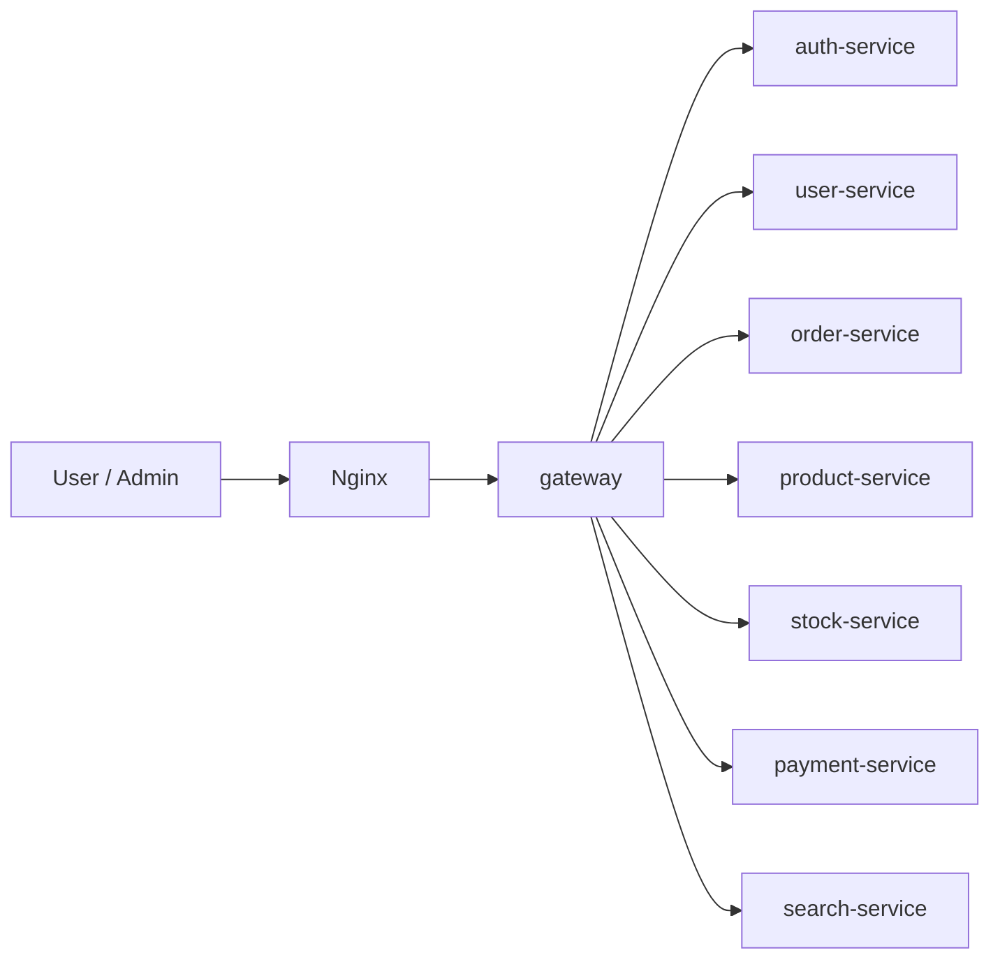
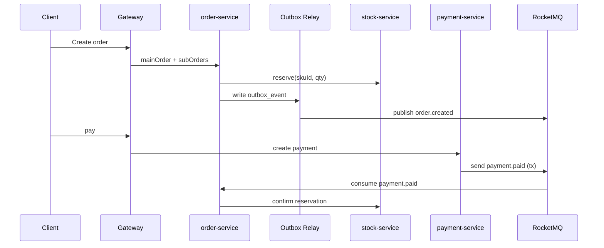

# Cloud Shop Microservices
Version: 1.1.0

[中文](./README-zh.md)

A simplified e-commerce microservices project.  
Backend: Spring Boot + Spring Cloud Alibaba.  
Frontend: UniApp (Vue 3 + TypeScript).

## Current Consistency Model

- Order/stock/refund events use local DB transactions + `outbox_event` for reliable messaging.
- Outbox relay runs inside each service (scheduled polling) and publishes to RocketMQ.
- Payment success is delivered via RocketMQ transactional message in `payment-service`.
- Consumers are idempotent (Redis-based) to tolerate replays.
- User notifications are enqueued to RocketMQ (`user-notification`) and retried on consumer failure.
- Seata TCC (order placement) and Seata SAGA (refund) are enabled in `order-service`; `payment-service` keeps Seata disabled.

## Modules And Ports

| Module | Port | Description |
| --- | --- | --- |
| `gateway` | `8080` | Unified gateway for `/api/**` and `/auth/**` |
| `auth-service` | `8081` | OAuth2/JWT auth and GitHub login |
| `user-service` | `8082` | User, merchant (enable + audit status), admin, profile, address |
| `order-service` | `8083` | Order and refund |
| `product-service` | `8084` | Product and category |
| `stock-service` | `8085` | Inventory and stock movement |
| `payment-service` | `8086` | Payment and Alipay integration |
| `search-service` | `8087` | Elasticsearch search |
| `my-shop-uniapp` | `5173` (dev) | Web/Android/iOS frontend (UniApp) |

## Quick Start

1. Start infrastructure:

```bash
bash scripts/dev/start-containers.sh
# PowerShell compatibility:
# powershell -File scripts/dev/start-containers.ps1
```

Optional: start with full monitoring stack (Prometheus + Grafana + exporters):

```bash
bash scripts/dev/start-containers.sh --with-monitoring
# PowerShell compatibility:
# powershell -File scripts/dev/start-containers.ps1 --with-monitoring
```

One-command startup for containers + services:

```bash
bash scripts/dev/start-platform.sh --with-monitoring
# PowerShell compatibility:
# powershell -File scripts/dev/start-platform.ps1 --with-monitoring
```

Compatibility alias:

```bash
bash scripts/dev/start-all.sh --with-monitoring
# PowerShell compatibility:
# powershell -File scripts/dev/start-all.ps1 --with-monitoring
```

2. Database bootstrap:
- Run `db/init/**/*.sql` first, then `db/test/**/*.sql` (optional).
- In the current closed development phase:
- MySQL is rebuilt on each container restart.
- History data is not preserved.
- Migration compatibility is not required.

3. Build backend:

```bash
mvn -T 1C clean package -DskipTests
```

4. Start backend services:

```bash
bash scripts/dev/start-services.sh
# PowerShell compatibility:
# powershell -File scripts/dev/start-services.ps1
```

When `start-services.*` is run directly, it auto-exports the local runtime addresses and development secrets required by gateway/auth, including `GATEWAY_SIGNATURE_SECRET`, `CLIENT_SERVICE_SECRET`, `APP_OAUTH2_*_CLIENT_SECRET`, and `APP_JWT_ALLOW_GENERATED_KEYPAIR`.
`start-platform.*` and `start-services.*` set `JAVA_TOOL_OPTIONS` and `SW_AGENT_NAME` for the 8 business services, using the agent under `docker/monitor/skywalking/agent/`, so HTTP, Dubbo, Redis, and JDBC/MyBatis traces show up in SkyWalking UI.

Restart only the services you changed:

```bash
bash scripts/dev/start-platform.sh --skip-containers --services=order-service,stock-service
# PowerShell compatibility:
# powershell -File scripts/dev/start-platform.ps1 --skip-containers --services=order-service
```

Service process logs are written to `.tmp/service-runtime/<service>/stdout.log` and `.tmp/service-runtime/<service>/stderr.log`.
Rolling application and error logs are written to `services/<service>/logs/` by default, or `.tmp/service-runtime/<service>/app-logs/` if the module log directory is not writable.

5. Build frontend:

```bash
pnpm --dir my-shop-uniapp install
pnpm --dir my-shop-uniapp build:h5
```

## Common Entrances

- Frontend: `http://127.0.0.1:18080`
- Gateway API Docs: `http://127.0.0.1:18080/doc.html`
- Nacos: `http://127.0.0.1:18080/nacos`
- RocketMQ Dashboard: `http://127.0.0.1:38082`
- MinIO Console: `http://127.0.0.1:19001`
- Elasticsearch: `http://127.0.0.1:19200`
- Kibana: `http://127.0.0.1:15601`
- Prometheus: `http://127.0.0.1:19099`
- Grafana: `http://127.0.0.1:13000`
- SkyWalking UI: `http://127.0.0.1:13001`
- Sentinel Dashboard: `http://127.0.0.1:18718`

## Druid / SkyWalking / XXL-Job

- Druid is enabled with `com.alibaba.druid.pool.DruidDataSource`.
- Transactional messaging is implemented via `outbox_event` + scheduled relay in `order-service`, `payment-service`, and `stock-service`.
- Seata TCC (order placement) and Seata SAGA (refund) are enabled in `order-service`; `payment-service` keeps Seata disabled.
- SkyWalking agent is stored under `docker/monitor/skywalking/agent/`.
- `start-platform.*` / `start-services.*` set `JAVA_TOOL_OPTIONS` and `SW_AGENT_NAME` for the 8 business services.
- Ignore paths are configured in `docker/monitor/skywalking/agent/config/apm-trace-ignore-plugin.config` (filters health check noise).
- SkyWalking OAP telemetry is exposed for Prometheus at `http://127.0.0.1:1234/metrics`.
- SkyWalking agent logs are written under `.tmp/service-runtime/<service>/skywalking-agent/`.
- XXL-Job executor is built in and disabled by default.

## Sentinel Circuit Breaking (Gateway)

- Sentinel is enabled in `gateway` and protects core v2 routes.
- Default threshold: `80 QPS / 1s` (configurable by env vars).
- Blocked requests return HTTP `429` with unified JSON payload.
- Sentinel dashboard: `http://127.0.0.1:18718` (docker compose).

## Service-To-Service Auth (Internal JWT)

- Selected approach: OAuth2 client credentials + JWT (not mTLS).
- Required scope/audience: `scope=internal` and `aud=internal-api` (validated by resource servers).
- Internal client allowlist: `app.security.jwt.internal-client-ids` (default `client-service`).
- Dubbo internal RPC is now used for service-to-service calls; `/internal/**` HTTP endpoints (if enabled) are retained for debug/regression only.

## Architecture Diagrams (Mermaid)

### 1) System Topology


```mermaid
flowchart LR
    U[User / Admin] --> N[Nginx]
    N --> G[gateway]
    G --> A[auth-service]
    G --> US[user-service]
    G --> OS[order-service]
    G --> PS[product-service]
    G --> SS[stock-service]
    G --> PAY[payment-service]
    G --> SE[search-service]
```

### 2) Order Main Flow


```mermaid
sequenceDiagram
    participant C as Client
    participant GW as Gateway
    participant O as order-service
    participant OB as Outbox Relay
    participant S as stock-service
    participant P as payment-service
    participant MQ as RocketMQ

    C->>GW: Create order
    GW->>O: mainOrder + subOrders
    O->>S: reserve(skuId, qty)
    O->>OB: write outbox_event
    OB->>MQ: publish order.created
    C->>GW: pay
    GW->>P: create payment
    P->>MQ: send payment.paid (tx)
    MQ->>O: consume payment.paid
    O->>S: confirm reservation
```

## Directory Overview

- `db/`: init/test/archive SQL
- `docker/`: infrastructure configs
- `tests/perf/k6/`: performance scripts
- `docs/`: ops and troubleshooting docs
- `docs/code-audit-2026-03-13-en.md`: 2026-03-13 backend code review & fix log (English)
- `docs/project-closeout.md`: frozen project state and resume order
- `docs/performance-baseline.md`: local performance ceilings, bottlenecks, and regression workflow
- `docs/cache-strategy.md`: cache strategy, TTLs, and service-level cache map
- `docs/transaction-strategy.md`: transaction strategy (TCC/SAGA/Outbox/RocketMQ)
- `docs/TEST_SCRIPT_INDEX.md`: test-script entrypoint index
- `docs/dev-startup.md`: unified startup entrypoints and common flags
- `docs/observability-stack.md`: SkyWalking + Prometheus + Grafana setup and monitoring scope
- `docs/seata-order-transaction.md`: Seata TCC/SAGA scope, startup prerequisites, and verification steps

## Postman Import

- Collection: `docs/postman/cloud-shop.postman_collection.json`
- Environment: `docs/postman/cloud-shop.local.postman_environment.json`
- Recommended order:
1. Import and activate `Cloud Shop Local` environment
2. Import the collection
3. Run `Auth/Login` first to auto-fill `accessToken` and `refreshToken`

# Frontend Entry & Ops Panels

## Frontend Entry

- Nginx deploy: `http://127.0.0.1:18080`
- Vite dev: `http://127.0.0.1:5173`

## Ops Panels / Management Consoles

- Gateway API Docs: `http://127.0.0.1:18080/doc.html`
- Nacos: `http://127.0.0.1:18080/nacos`
- RocketMQ Dashboard: `http://127.0.0.1:38082`
- MinIO Console: `http://127.0.0.1:19001`
- Elasticsearch: `http://127.0.0.1:19200`
- Kibana: `http://127.0.0.1:15601`
- Prometheus: `http://127.0.0.1:19099`
- Grafana: `http://127.0.0.1:13000`
- SkyWalking UI: `http://127.0.0.1:13001`

## Performance Baseline

- See `docs/performance-baseline.md` for:
- Hot data cache strategy
- Timeout control baseline
- Connection/thread/queue capacity planning
- Async model (MQ + `@Async`)
- MySQL index rules
