# Cloud微服务平台 - 开发规范文档

**文档版本**: v3.0 (2025-09-14)  
**项目版本**: 0.0.1-SNAPSHOT  
**维护团队**: Cloud Development Team

## 项目概述

Cloud微服务平台是一个基于Spring Boot 3.x + Spring Cloud 2025 + Spring Cloud Alibaba的现代化企业级微服务架构项目。项目采用最新的技术栈，实现了完整的OAuth2.1标准认证授权、多级缓存架构、响应式编程模型等先进特性，为企业数字化转型提供强有力的技术支撑。

### 核心特性

#### 🏗️ 现代化架构
- **Spring Boot 3.5.3**: 最新稳定版本，Java 17原生支持
- **Spring Cloud 2025.0.0**: 下一代云原生架构
- **OAuth2.1标准**: 完整实现授权服务器和资源服务器
- **响应式网关**: WebFlux响应式编程，高并发处理

#### ⚡ 性能优化
- **多级缓存**: L1(Caffeine本地) + L2(Redis分布式)
- **缓存策略分离**: 多级缓存 vs Redis纯缓存按业务选择
- **连接池优化**: HikariCP数据库连接池调优
- **异步处理**: CompletableFuture异步任务执行

#### 🔐 安全保障
- **OAuth2.1 + PKCE**: 移动端安全增强
- **JWT Token管理**: 生成、刷新、撤销完整生命周期
- **网关统一鉴权**: 所有API请求统一安全验证
- **细粒度权限**: 方法级权限控制

#### 🚀 开发效率
- **Common Module重构**: 统一基础配置和异常处理
- **Code Generation**: MapStruct自动对象映射
- **API文档自动化**: Knife4j + SpringDoc集成
- **统一响应格式**: Result<T>和PageResult<T>标准化
## 🏗️ 系统架构图

### OAuth2.1标准架构

```mermaid
graph TB
    Client[📱 客户端/用户] --> Gateway[🚪 Gateway<br/>响应式网关<br/>OAuth2.1 资源服务器]
    Gateway --> Auth[🔐 Auth Service<br/>OAuth2.1 授权服务器<br/>JWT Token 管理]
    Gateway --> User[👤 User Service<br/>用户服务<br/>多级缓存]
    Gateway --> Product[📎 Product Service<br/>商品服务<br/>多级缓存]
    
    Product --> Stock[📦 Stock Service<br/>库存服务<br/>Redis统一缓存]
    Product --> Order[📋 Order Service<br/>订单服务<br/>分布式事务]
    Order --> Payment[💳 Payment Service<br/>支付服务<br/>安全支付]
    
    Gateway --> Search[🔍 Search Service<br/>搜索服务<br/>Elasticsearch]
    Gateway --> Log[📄 Log Service<br/>日志服务<br/>ELK Stack]
    
    Common[🔧 Common Module<br/>通用模块<br/>v2.0 重构版本] -.-> User
    Common -.-> Product
    Common -.-> Stock
    Common -.-> Order
    Common -.-> Payment
    
    classDef gateway fill:#e1f5fe
    classDef auth fill:#f3e5f5
    classDef business fill:#e8f5e8
    classDef support fill:#fff3e0
    
    class Gateway gateway
    class Auth auth
    class User,Product,Stock,Order,Payment business
    class Search,Log,Common support
```


```

## 🔌 服务端口分配

| 服务名称 | 端口 | 状态 | 说明 |
|---------|------|------|------|
| Gateway | 80 | ✅ | 响应式网关，OAuth2.1资源服务器 |
| Auth Service | 8081 | ✅ | OAuth2.1授权服务器，JWT Token管理 |
| User Service | 8082 | ✅ | 用户服务，多级缓存 |
| Product Service | 8083 | ✅ | 商品服务，多级缓存 |
| Stock Service | 8084 | ✅ | 库存服务，Redis统一缓存 |
| Order Service | 8085 | ✅ | 订单服务，分布式事务 |
| Payment Service | 8086 | ✅ | 支付服务，安全支付 |
| Search Service | 8087 | ✅ | 搜索服务，Elasticsearch |
| Log Service | 8088 | ✅ | 日志服务，ELK Stack |

## 数据库设计

### 数据库分配

| 服务名称            | 数据库名称            | 说明     |
|-----------------|------------------|--------|
| User Service    | cloud_user_db    | 用户相关数据 |
| Product Service | cloud_product_db | 商品相关数据 |
| Stock Service   | cloud_stock_db   | 库存相关数据 |
| Order Service   | cloud_order_db   | 订单相关数据 |
| Payment Service | cloud_payment_db | 支付相关数据 |
| Auth Service    | cloud_auth_db    | 认证授权数据 |
| Log Service     | cloud_log_db     | 日志数据   |

### Redis Database分配

| 服务名称            | Redis DB | 说明   |
|-----------------|----------|------|
| User Service    | 0        | 用户缓存 |
| Product Service | 1        | 商品缓存 |
| Stock Service   | 2        | 库存缓存 |
| Order Service   | 3        | 订单缓存 |
| Payment Service | 4        | 支付缓存 |
| Auth Service    | 5        | 认证缓存 |
| Gateway         | 6        | 网关缓存 |

## 技术选型对比

### 缓存策略对比

| 服务              | 缓存策略     | L1缓存(Caffeine) | L2缓存(Redis) | 说明         |
|-----------------|----------|----------------|-------------|------------|
| User Service    | 多级缓存     | ✅              | ✅           | 高频访问，多级优化  |
| Product Service | 多级缓存     | ✅              | ✅           | 商品信息查询频繁   |
| Stock Service   | Redis纯缓存 | ❌              | ✅           | 保证库存数据一致性  |
| Order Service   | 待实现      | -              | -           | 订单数据实时性要求高 |
| Payment Service | 待实现      | -              | -           | 支付数据安全性优先  |

### 事务管理策略

| 服务              | 本地事务       | 分布式事务  | 说明         |
|-----------------|------------|--------|------------|
| User Service    | ✅ Spring事务 | ❌      | 用户操作相对独立   |
| Product Service | ✅ Spring事务 | ❌      | 商品操作相对独立   |
| Stock Service   | ✅ Spring事务 | ✅ 计划支持 | 库存操作需要强一致性 |
| Order Service   | ✅ Spring事务 | ✅ 必需   | 订单涉及多服务协调  |
| Payment Service | ✅ Spring事务 | ✅ 必需   | 支付需要强一致性保证 |

## 开发进度

### 已完成服务

#### 1. Common Module (通用模块)

**状态**: ✅ 已完成  
**功能**:

- 统一响应格式(Result, PageResult)
- 基础实体类(BaseEntity)
- 多级缓存注解(@MultiLevelCacheable等)
- 统一异常类
- 工具类(BeanCopyUtils等)
- 本地缓存基础配置

#### 2. User Service (用户服务)

**状态**: ✅ 已完成  
**缓存策略**: 多级缓存(L1: Caffeine + L2: Redis)  
**核心功能**:

- 用户CRUD操作
- 用户分页查询
- 用户状态管理
- 权限验证
- 多级缓存优化
- 全局异常处理

**特色实现**:

- MultiLevelCacheAspect AOP实现多级缓存
- 查询优先本地缓存，写操作同步更新双层缓存
- 完整的参数校验和权限控制
- 统一的REST API设计

#### 3. Product Service (商品服务)

**状态**: ✅ 已完成  
**缓存策略**: 多级缓存(L1: Caffeine + L2: Redis)  
**核心功能**:

- 商品CRUD操作
- 商品分页查询(支持多维度筛选)
- 商品状态管理(上架/下架)
- 库存管理(增加/减少/检查)
- 统计分析功能
- 缓存预热和管理

**特色实现**:

- 复杂的分页查询条件(价格区间、库存区间、多字段排序)
- 完整的库存管理功能
- 商品状态描述自动转换
- 批量操作支持

#### 4. Stock Service (库存服务)

**状态**: ✅ 已完成  
**缓存策略**: Redis纯缓存  
**核心功能**:

- 库存CRUD操作
- 库存预扣和释放
- 库存充足性检查
- 库存流水记录(入库/出库)
- 库存统计分析

**特色实现**:

- RedisCacheAspect AOP实现Redis纯缓存
- 库存操作与流水记录同步处理
- 强一致性保证，无本地缓存
- 库存状态自动计算

### 进行中服务

#### 5. Order Service (订单服务)

**状态**: 🚧 待实现  
**计划缓存策略**: Redis缓存 + 分布式事务  
**计划功能**:

- 订单创建和管理
- 订单状态流转
- 订单支付集成
- 库存扣减协调
- 订单查询和统计

#### 6. Payment Service (支付服务)

**状态**: 🚧 待实现  
**计划缓存策略**: Redis缓存  
**计划功能**:

- 支付订单创建
- 支付状态管理
- 支付回调处理
- 退款功能
- 支付统计

### 基础服务

#### 7. Auth Service (认证服务)

**状态**: ✅ OAuth2.1重构完成  
**架构角色**: OAuth2.1授权服务器
**功能**:

- OAuth2.1标准授权服务器实现
- 支持授权码模式(PKCE)和客户端凭证模式
- JWT Token的生成、刷新、撤销管理
- 多客户端支持：Web、移动端、服务间通信
- Redis持久化授权信息存储
- 用户认证和注册接口
- 完整的OAuth2.1端点支持

#### 8. Gateway (网关服务)

**状态**: ✅ OAuth2.1重构完成  
**架构角色**: OAuth2.1资源服务器
**功能**:

- 统一的OAuth2.1鉴权入口
- JWT Token验证和权限检查
- 路由转发和负载均衡
- 无依赖common-module的纯净设计
- 支持所有OAuth2.1标准端点路由

#### 9. Search Service (搜索服务)

**状态**: 🚧 待实现  
**计划功能**:

- 商品搜索
- 用户搜索
- 搜索推荐
- 搜索统计

#### 10. Log Service (日志服务)

**状态**: ✅ 基础完成  
**功能**:

- 日志收集
- 日志存储
- 日志查询
- 日志分析

## OAuth2.1标准架构

### 架构概览

本项目完整实现了OAuth2.1标准架构，包含授权服务器和资源服务器两个核心组件：

```
       用户/客户端
           │
    ┗━ 1. 认证请求
           │
   ┌─────┴─────┐
   │     Gateway     │  <-- OAuth2.1 资源服务器
   │  统一鉴权入口  │  <-- JWT Token 验证
   └─────┬─────┘
           │
    ┗━ 2. token验证 & 路由转发
           │
   ┌─────┴─────┐
   │  Auth Service   │  <-- OAuth2.1 授权服务器
   │   JWT Token     │  <-- Token 生成/刷新/撤销
   │     管理       │  <-- 用户认证
   └───────────┘
```

### OAuth2.1 流程

#### 1. 授权码模式 (PKCE)

```
1. 客户端 -> Gateway -> Auth Service: /oauth2/authorize
2. 用户认证后返回授权码
3. 客户端 -> Gateway -> Auth Service: /oauth2/token + 授权码
4. 返回 JWT Access Token + Refresh Token
```

#### 2. 客户端凭证模式

```
1. 服务 -> Gateway -> Auth Service: /oauth2/token + client_credentials
2. 返回 JWT Access Token
```

#### 3. 资源访问

```
1. 客户端 -> Gateway: API请求 + Bearer Token
2. Gateway: JWT验证 + 权限检查
3. Gateway -> 业务服务: 转发请求
```

### 技术特性

- **PKCE 支持**: 移动客户端必须使用PKCE增强安全
- **短期 Token**: Access Token 2小时，Refresh Token 30天
- **Token 不重用**: 每次刷新生成新的Refresh Token
- **Redis 存储**: 所有授权信息存储在Redis中
- **统一鉴权**: 所有API请求经过Gateway统一鉴权

### 客户端配置

| 客户端类型 | Client ID | 认证方式 | 授权模式 | PKCE |
|------------|-----------|------------|------------|------|
| Web应用 | web-client | Client Secret | Authorization Code | ✓ |
| 移动应用 | mobile-client | None (公共客户端) | Authorization Code | ✓ |
| 服务间 | client-service | Client Secret | Client Credentials | ✗ |

## 核心技术实现

### 1. 多级缓存实现详解

#### 架构设计

```java
// L1缓存配置 (Caffeine)
@Configuration
public class LocalCacheConfig extends BaseLocalCacheConfig {
    @Override
    public CacheManager localCacheManager() {
        CaffeineCacheManager cacheManager = new CaffeineCacheManager();
        cacheManager.setCaffeine(buildCaffeineSpec(
                100,    // 初始容量
                1000L,  // 最大容量
                60L,    // 写入后过期时间
                30L,    // 访问后过期时间
                TimeUnit.MINUTES
        ));
        return cacheManager;
    }
}

// L2缓存配置 (Redis)
@Configuration
public class RedisConfig {
    @Bean
    public RedisTemplate<String, Object> redisTemplate(RedisConnectionFactory factory) {
        // Redis序列化配置
        RedisTemplate<String, Object> template = new RedisTemplate<>();
        template.setConnectionFactory(factory);
        // 设置序列化器
        template.setKeySerializer(new StringRedisSerializer());
        template.setValueSerializer(new Jackson2JsonRedisSerializer<>(Object.class));
        return template;
    }
}

// AOP切面实现
@Aspect
@Component
public class MultiLevelCacheAspect {
    @Around("@annotation(com.cloud.common.cache.annotation.MultiLevelCacheable)")
    public Object handleCacheable(ProceedingJoinPoint joinPoint) {
        // 1. 先查L1缓存
        // 2. L1未命中查L2缓存
        // 3. L2未命中执行方法
        // 4. 结果写入L1和L2缓存
    }
}
```

#### 缓存更新策略

- **写操作**: 先更新数据库，后更新缓存(Cache-Aside模式)
- **删除操作**: 先删除数据库，后清除缓存
- **批量操作**: 清除相关缓存分区

### 2. Redis纯缓存实现详解

#### 设计原因

Stock Service使用Redis纯缓存而不是多级缓存，主要考虑：

- **数据一致性**: 库存数据要求强一致性
- **并发安全**: Redis单线程特性保证操作原子性
- **集群共享**: 多实例间库存数据必须共享

#### 实现方式

```java

@Aspect
@Component
public class RedisCacheAspect {
    @Around("@annotation(com.cloud.common.cache.annotation.RedisCacheable)")
    public Object handleRedisCacheable(ProceedingJoinPoint joinPoint) {
        // 直接查询Redis，未命中时执行方法并缓存
        String key = generateKey(joinPoint, annotation.key());
        Object result = redisTemplate.opsForValue().get(key);

        if (result == null) {
            result = joinPoint.proceed();
            if (result != null) {
                redisTemplate.opsForValue().set(key, result, expire, timeUnit);
            }
        }
        return result;
    }
}
```

### 3. 统一异常处理

```java

@RestControllerAdvice
public class GlobalExceptionHandler {

    // 参数校验异常
    @ExceptionHandler(MethodArgumentNotValidException.class)
    public Result<String> handleValidationException(MethodArgumentNotValidException ex) {
        String message = ex.getBindingResult()
                .getFieldErrors()
                .stream()
                .map(FieldError::getDefaultMessage)
                .collect(Collectors.joining("; "));
        return Result.error("VALIDATION_ERROR", message);
    }

    // 业务异常
    @ExceptionHandler(BusinessException.class)
    public Result<String> handleBusinessException(BusinessException ex) {
        return Result.error(ex.getCode(), ex.getMessage());
    }

    // 系统异常
    @ExceptionHandler(Exception.class)
    public Result<String> handleException(Exception ex) {
        log.error("系统异常", ex);
        return Result.error("SYSTEM_ERROR", "系统繁忙，请稍后重试");
    }
}
```

### 4. 权限控制实现

```java
// 方法级权限控制
@PreAuthorize("hasAuthority('USER_CREATE')")
public Result<Long> createUser(@Valid @RequestBody UserRequestDTO dto) {
    return Result.success(userService.createUser(dto));
}

// 复合权限控制
@PreAuthorize("hasAnyAuthority('USER_VIEW', 'USER_ADMIN')")
public Result<UserVO> getUserById(@PathVariable Long id) {
    return Result.success(userService.getUserById(id));
}

// 数据权限控制（计划实现）
@PostAuthorize("hasPermission(returnObject, 'READ')")
public UserVO getUserById(Long id) {
    return userService.getUserById(id);
}
```

## API设计标准

### 1. URL设计规范

#### 查询接口

```
GET /api/v1/users/{id}              # 获取单个用户
GET /api/v1/users/page              # 分页查询用户
GET /api/v1/users/batch?ids=1,2,3   # 批量查询用户
GET /api/v1/users/stats/total       # 获取用户统计
```

#### 管理接口

```
POST   /api/v1/users/manage         # 创建用户
PUT    /api/v1/users/manage/{id}    # 更新用户
DELETE /api/v1/users/manage/{id}    # 删除用户
PUT    /api/v1/users/manage/{id}/enable   # 启用用户
PUT    /api/v1/users/manage/{id}/disable  # 禁用用户
DELETE /api/v1/users/manage/cache/all     # 清除缓存
```

### 2. 响应格式标准

#### 统一响应结构

```java
public class Result<T> {
    private Integer code;     // 响应码
    private String message;   // 响应消息
    private T data;          // 响应数据
    private Long timestamp;   // 时间戳
}

public class PageResult<T> {
    private List<T> records;  // 数据列表
    private Long total;       // 总数
    private Integer pageNum;  // 页码
    private Integer pageSize; // 页大小
    private Integer pages;    // 总页数
}
```

#### 响应码标准

```java
public enum ResultCode {
    SUCCESS(200, "操作成功"),
    PARAM_ERROR(400, "参数错误"),
    UNAUTHORIZED(401, "未认证"),
    FORBIDDEN(403, "无权限"),
    NOT_FOUND(404, "资源不存在"),
    SERVER_ERROR(500, "服务器内部错误"),

    // 业务错误码
    USER_NOT_FOUND(1001, "用户不存在"),
    PRODUCT_NOT_FOUND(2001, "商品不存在"),
    STOCK_INSUFFICIENT(3001, "库存不足")
}
```

### 3. 参数校验标准

```java
public class UserRequestDTO {
    @NotBlank(message = "用户名不能为空")
    @Size(min = 2, max = 50, message = "用户名长度必须在2-50个字符之间")
    private String username;

    @NotNull(message = "年龄不能为空")
    @Min(value = 0, message = "年龄不能小于0")
    @Max(value = 150, message = "年龄不能大于150")
    private Integer age;

    @Email(message = "邮箱格式不正确")
    private String email;

    @Pattern(regexp = "^1[3-9]\\d{9}$", message = "手机号格式不正确")
    private String phone;
}
```

## 测试策略

### 1. 单元测试

#### Service层测试

```java

@ExtendWith(MockitoExtension.class)
class UserServiceImplTest {

    @Mock
    private UserMapper userMapper;

    @Mock
    private CacheManager cacheManager;

    @InjectMocks
    private UserServiceImpl userService;

    @Test
    void 创建用户_应该返回用户ID_当输入有效数据() {
        // Given
        UserRequestDTO dto = new UserRequestDTO("test", 25);
        User user = new User();
        when(userMapper.insert(any())).thenReturn(1);

        // When
        Long result = userService.createUser(dto);

        // Then
        assertThat(result).isNotNull();
        verify(userMapper).insert(any());
    }
}
```

#### Controller层测试

```java

@WebMvcTest(UserQueryController.class)
class UserQueryControllerTest {

    @Autowired
    private MockMvc mockMvc;

    @MockBean
    private UserService userService;

    @Test
    void 获取用户详情_应该返回用户信息_当用户存在() throws Exception {
        // Given
        UserVO userVO = new UserVO(1L, "test", 25);
        when(userService.getUserById(1L)).thenReturn(userVO);

        // When & Then
        mockMvc.perform(get("/api/v1/users/1"))
                .andExpect(status().isOk())
                .andExpect(jsonPath("$.code").value(200))
                .andExpect(jsonPath("$.data.username").value("test"));
    }
}
```

### 2. 集成测试

#### API集成测试

```java

@SpringBootTest(webEnvironment = SpringBootTest.WebEnvironment.RANDOM_PORT)
@TestMethodOrder(OrderAnnotation.class)
class UserServiceIntegrationTest {

    @Autowired
    private TestRestTemplate restTemplate;

    @Test
    @Order(1)
    void 创建用户接口测试() {
        UserRequestDTO dto = new UserRequestDTO("integration_test", 30);

        ResponseEntity<Result> response = restTemplate.postForEntity(
                "/api/v1/users/manage", dto, Result.class);

        assertThat(response.getStatusCode()).isEqualTo(HttpStatus.OK);
        assertThat(response.getBody().getCode()).isEqualTo(200);
    }
}
```

### 3. 缓存测试

```java

@SpringBootTest
@TestPropertySource(properties = {
        "cache.multi-level.local.enabled=true",
        "cache.multi-level.redis.enabled=true"
})
class CacheIntegrationTest {

    @Autowired
    private UserService userService;

    @Autowired
    private RedisTemplate<String, Object> redisTemplate;

    @Test
    void 多级缓存测试_本地缓存命中() {
        // 第一次查询，数据库查询并缓存
        UserVO user1 = userService.getUserById(1L);

        // 第二次查询，本地缓存命中
        UserVO user2 = userService.getUserById(1L);

        assertThat(user1).isEqualTo(user2);
        // 验证Redis中有数据
        assertThat(redisTemplate.hasKey("userCache:1")).isTrue();
    }
}
```

## 性能优化策略

### 1. 缓存优化

#### 多级缓存配置优化

```yaml
cache:
  multi-level:
    local:
      initial-capacity: 100      # 根据业务调整初始容量
      maximum-size: 1000        # 根据内存情况调整最大容量
      expire-after-write: 60m   # 根据数据更新频率调整
      expire-after-access: 30m  # 根据访问模式调整
    redis:
      default-expire: 120m      # Redis过期时间通常比本地缓存长
```

#### 缓存预热策略

```java

@Component
public class CacheWarmupService {

    @EventListener(ApplicationReadyEvent.class)
    public void warmupCache() {
        // 预热热点用户数据
        List<Long> hotUserIds = getUserHotIds();
        userService.warmupUserCache(hotUserIds);

        // 预热热点商品数据
        List<Long> hotProductIds = getProductHotIds();
        productService.warmupProductCache(hotProductIds);
    }
}
```

### 2. 数据库优化

#### 索引优化建议

```sql
-- 用户表索引
CREATE INDEX idx_users_username ON users (username);
CREATE INDEX idx_users_email ON users (email);
CREATE INDEX idx_users_status_create_time ON users (status, create_time);

-- 商品表索引
CREATE INDEX idx_products_category_status ON products (category_id, status);
CREATE INDEX idx_products_brand_status ON products (brand_id, status);
CREATE INDEX idx_products_price_stock ON products (price, stock);

-- 库存表索引
CREATE INDEX idx_stocks_product_id ON stocks (product_id);
CREATE INDEX idx_stock_in_out_product_time ON stock_in_out (product_id, operate_time);
```

#### 分页查询优化

```java
// 使用游标分页替代offset分页（大数据量场景）
@Query("SELECT * FROM users WHERE id > :lastId ORDER BY id LIMIT :size")
List<User> findUsersAfter(@Param("lastId") Long lastId, @Param("size") int size);

// 使用覆盖索引优化count查询
@Query("SELECT COUNT(1) FROM users WHERE status = :status")
long countByStatus(@Param("status") Integer status);
```

### 3. 代码优化

#### 异步处理

```java

@Service
public class AsyncUserService {

    @Async("taskExecutor")
    public CompletableFuture<Void> sendWelcomeEmail(Long userId) {
        // 异步发送邮件，不影响主流程
        return CompletableFuture.completedFuture(null);
    }

    @Async("taskExecutor")
    public CompletableFuture<Void> updateUserStats(Long userId) {
        // 异步更新用户统计信息
        return CompletableFuture.completedFuture(null);
    }
}

@Configuration
@EnableAsync
public class AsyncConfig {

    @Bean("taskExecutor")
    public ThreadPoolTaskExecutor taskExecutor() {
        ThreadPoolTaskExecutor executor = new ThreadPoolTaskExecutor();
        executor.setCorePoolSize(10);
        executor.setMaxPoolSize(20);
        executor.setQueueCapacity(200);
        executor.setThreadNamePrefix("async-");
        executor.initialize();
        return executor;
    }
}
```

#### 批量操作优化

```java
// 批量插入优化
@Service
public class BatchUserService {

    public void batchCreateUsers(List<UserRequestDTO> userList) {
        List<User> users = userList.stream()
                .map(userConverter::toEntity)
                .collect(Collectors.toList());

        // 使用MyBatis Plus批量插入
        userService.saveBatch(users, 1000); // 每批1000条

        // 异步预热缓存
        List<Long> userIds = users.stream()
                .map(User::getId)
                .collect(Collectors.toList());
        asyncUserService.warmupUserCache(userIds);
    }
}
```

## 监控与运维

### 1. 应用监控

#### 监控指标

```yaml
management:
  endpoints:
    web:
      exposure:
        include: health,info,metrics,prometheus
  endpoint:
    health:
      show-details: always
    metrics:
      enabled: true
  metrics:
    tags:
      application: ${spring.application.name}
    export:
      prometheus:
        enabled: true
```

#### 自定义指标

```java

@Component
public class CustomMetrics {

    private final Counter userCreatedCounter;
    private final Timer userQueryTimer;
    private final Gauge cacheHitRatio;

    public CustomMetrics(MeterRegistry meterRegistry) {
        this.userCreatedCounter = Counter.builder("user.created")
                .description("用户创建数量")
                .register(meterRegistry);

        this.userQueryTimer = Timer.builder("user.query.duration")
                .description("用户查询耗时")
                .register(meterRegistry);
    }

    public void recordUserCreated() {
        userCreatedCounter.increment();
    }

    public Timer.Sample startQueryTimer() {
        return Timer.start(userQueryTimer);
    }
}
```

### 2. 健康检查

```java

@Component
public class DatabaseHealthIndicator implements HealthIndicator {

    @Autowired
    private UserMapper userMapper;

    @Override
    public Health health() {
        try {
            long count = userMapper.selectCount(null);
            return Health.up()
                    .withDetail("database", "available")
                    .withDetail("userCount", count)
                    .build();
        } catch (Exception e) {
            return Health.down()
                    .withDetail("database", "unavailable")
                    .withException(e)
                    .build();
        }
    }
}
```

### 3. 日志配置

```yaml
logging:
  level:
    root: INFO
    com.cloud: DEBUG
    org.springframework.cache: DEBUG
    org.springframework.data.redis: WARN
  pattern:
    console: "%d{yyyy-MM-dd HH:mm:ss.SSS} [%thread] %-5level [%X{traceId}] %logger{36} - %msg%n"
    file: "%d{yyyy-MM-dd HH:mm:ss.SSS} [%thread] %-5level [%X{traceId}] %logger{36} - %msg%n"
  file:
    name: logs/${spring.application.name}.log
    max-size: 100MB
    max-history: 30
```

## 部署指南

### 1. 环境要求

#### 基础环境

- **JDK**: 17+
- **Maven**: 3.6+
- **MySQL**: 8.0+
- **Redis**: 6.0+
- **Nacos**: 2.0+

#### 服务器资源建议

| 环境   | CPU | 内存   | 存储     | 说明      |
|------|-----|------|--------|---------|
| 开发环境 | 2核  | 4GB  | 50GB   | 单机部署    |
| 测试环境 | 4核  | 8GB  | 100GB  | 单机或容器部署 |
| 生产环境 | 8核  | 16GB | 200GB+ | 集群部署    |

### 2. 配置管理

#### Nacos配置示例

```yaml
# nacos配置中心 - user-service-dev.yaml
server:
  port: 8082

spring:
  datasource:
    url: jdbc:mysql://localhost:3306/cloud_user_dev
    username: ${DB_USERNAME:root}
    password: ${DB_PASSWORD:password}

  redis:
    host: ${REDIS_HOST:localhost}
    port: ${REDIS_PORT:6379}
    database: 0
    password: ${REDIS_PASSWORD:}

cache:
  multi-level:
    local:
      enabled: true
      maximum-size: 500
    redis:
      enabled: true
      default-expire: 60m
```

### 3. Docker部署

#### Dockerfile示例

```dockerfile
FROM openjdk:17-jdk-slim

LABEL maintainer="cloud-team"

COPY target/*.jar app.jar

EXPOSE 8080

ENV JAVA_OPTS=""
ENV SPRING_PROFILES_ACTIVE="docker"

ENTRYPOINT ["sh", "-c", "java $JAVA_OPTS -jar /app.jar --spring.profiles.active=$SPRING_PROFILES_ACTIVE"]
```

#### Docker Compose示例

```yaml
version: '3.8'

services:
  user-service:
    build: ./user-service
    ports:
      - "8082:8082"
    environment:
      - SPRING_PROFILES_ACTIVE=docker
      - DB_HOST=mysql
      - REDIS_HOST=redis
      - NACOS_SERVER=nacos:8848
    depends_on:
      - mysql
      - redis
      - nacos
    networks:
      - cloud-network

  mysql:
    image: mysql:8.0
    ports:
      - "3306:3306"
    environment:
      - MYSQL_ROOT_PASSWORD=password
      - MYSQL_DATABASE=cloud_user
    volumes:
      - mysql_data:/var/lib/mysql
    networks:
      - cloud-network

  redis:
    image: redis:6.2
    ports:
      - "6379:6379"
    networks:
      - cloud-network

networks:
  cloud-network:
    driver: bridge

volumes:
  mysql_data:
```

## 常见问题解决

### 1. 缓存相关问题

#### 缓存穿透

```java

@MultiLevelCacheable(value = "userCache", key = "#id",
        condition = "#id != null",
        unless = "#result == null")
public UserVO getUserById(Long id) {
    if (id == null || id <= 0) {
        return null; // 防止缓存null值
    }
    return userService.getUserById(id);
}
```

#### 缓存雪崩

```yaml
cache:
  multi-level:
    redis:
      default-expire: 60m
      expire-random-range: 10m  # 过期时间随机化，防止同时过期
```

#### 缓存一致性

```java

@Transactional(rollbackFor = Exception.class)
@MultiLevelCaching(
        put = @MultiLevelCachePut(value = "userCache", key = "#id"),
        evict = @MultiLevelCacheEvict(value = "userListCache", allEntries = true)
)
public Boolean updateUser(Long id, UserRequestDTO dto) {
    // 先更新数据库
    boolean success = updateUserInDb(id, dto);
    if (!success) {
        throw new RuntimeException("更新失败");
    }
    // 事务提交后，AOP自动更新缓存
    return true;
}
```

### 2. 数据库相关问题

#### 连接池配置

```yaml
spring:
  datasource:
    hikari:
      minimum-idle: 5
      maximum-pool-size: 20
      idle-timeout: 300000
      max-lifetime: 1800000
      connection-timeout: 30000
      connection-test-query: SELECT 1
```

#### 慢查询优化

```java
// 使用MyBatis Plus的性能分析插件
@Configuration
public class MybatisPlusConfig {

    @Bean
    @Profile({"dev", "test"}) // 仅在开发和测试环境启用
    public PerformanceInterceptor performanceInterceptor() {
        PerformanceInterceptor interceptor = new PerformanceInterceptor();
        interceptor.setMaxTime(1000); // 超过1秒的查询会被记录
        interceptor.setFormat(true);   // SQL格式化
        return interceptor;
    }
}
```

### 3. 网络相关问题

#### Feign调用超时

```yaml
feign:
  client:
    config:
      default:
        connect-timeout: 5000
        read-timeout: 10000
  hystrix:
    enabled: true

hystrix:
  command:
    default:
      execution:
        isolation:
          thread:
            timeout-in-milliseconds: 15000
```

#### 服务发现问题

```yaml
spring:
  cloud:
    nacos:
      discovery:
        server-addr: ${NACOS_SERVER:localhost:8848}
        namespace: ${NACOS_NAMESPACE:public}
        group: ${NACOS_GROUP:DEFAULT_GROUP}
        heart-beat-interval: 5000
        heart-beat-timeout: 15000
        ip-delete-timeout: 30000
```

## 后续开发计划

### 阶段一：订单和支付服务完善

1. **Order Service完整实现**
    - 订单创建流程
    - 库存扣减集成
    - 订单状态管理
    - 分布式事务支持

2. **Payment Service完整实现**
    - 支付网关集成
    - 支付状态管理
    - 退款功能
    - 支付安全

### 阶段二：高级功能实现

1. **分布式事务**
    - Seata集成
    - TCC事务模式
    - 事务补偿机制

2. **消息队列增强**
    - 事件驱动架构
    - 消息可靠性保证
    - 死信队列处理

3. **搜索功能**
    - Elasticsearch集成
    - 全文搜索
    - 搜索推荐

### 阶段三：运维和监控完善

1. **链路跟踪**
    - SkyWalking集成
    - 分布式链路追踪
    - 性能分析

2. **统一日志**
    - ELK Stack集成
    - 日志聚合分析
    - 告警机制

3. **自动化部署**
    - CI/CD流水线
    - 容器化部署
    - 蓝绿部署

---

本文档将随着项目的发展持续更新，确保开发团队始终有最新的技术指导和参考资料。
