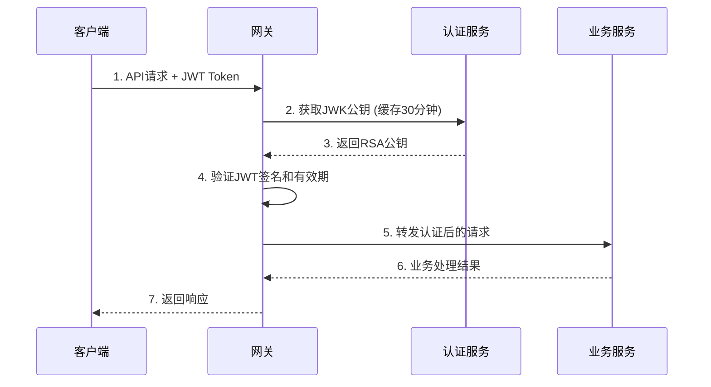

# 网关服务开发文档

## 项目概述

网关服务 (gateway) 是云商城微服务架构的统一入口，基于 Spring Cloud Gateway 响应式架构实现，提供路由转发、统一认证、跨域处理、限流熔断等核心功能。

### 主要功能

- API 路由和负载均衡
- OAuth2.1 统一身份认证
- 跨域 (CORS) 请求处理
- 请求限流和熔断保护
- 统一 API 文档聚合
- 安全头配置和 XSS 防护
- IP 白名单和黑名单管理
- 性能监控和链路追踪

## 技术栈

### 核心框架

- **Spring Boot**: 3.5.3
- **Spring Cloud**: 2025.0.0
- **Spring Cloud Alibaba**: 2025.0.0.0-preview
- **Spring Cloud Gateway**: WebFlux 响应式
- **Spring Security OAuth2**: 资源服务器
- **Java版本**: 17 LTS

### 依赖版本

```xml
<spring-boot.version>3.5.3</spring-boot.version>
<spring-cloud.version>2025.0.0</spring-cloud.version>
<spring-cloud-alibaba.version>2025.0.0.0-preview</spring-cloud-alibaba.version>
<java.version>17</java.version>
<spring-cloud-gateway.version>响应式WebFlux</spring-cloud-gateway.version>
```

### 基础设施

- **Nacos**: 服务发现和配置中心 (端口: 8848)
- **Redis**: 限流和缓存 (数据库6)
- **OAuth2.1 认证**: auth-service 集成 (端口: 8080)

## 服务配置

### 服务基本信息

- **服务名称**: gateway
- **运行端口**: 80 (统一入口)
- **架构类型**: 响应式 WebFlux
- **认证方式**: OAuth2.1 JWT (JWK 端点验证)
- **负载均衡**: Spring Cloud LoadBalancer

### 关键配置

```yaml
server:
  port: 80  # 统一网关入口

spring:
  application:
    name: gateway
  main:
    allow-bean-definition-overriding: true
  cloud:
    gateway:
      discovery:
        locator:
          enabled: true  # 启用服务发现路由
          lower-case-service-id: true
      # 跨域配置
      globals:
        cors-configurations:
          '[/**]':
            allowedOriginPatterns:
              - "http://localhost:*"
              - "http://127.0.0.1:*"
              - "https://*.yourdomain.com"
            allowedMethods: [GET, POST, PUT, DELETE, OPTIONS]
            allowedHeaders: ["Authorization", "Content-Type", "Accept", "X-Requested-With"]
            allowCredentials: true
            maxAge: 3600
      # 全局过滤器
      default-filters:
        - name: Security
          args:
            enableIpCheck: true
            enableRateLimit: true
            enableTokenCheck: true
            enablePerformanceMonitoring: true
  security:
    oauth2:
      resourceserver:
        jwt:
          jwk-set-uri: http://127.0.0.1:80/.well-known/jwks.json
          issuer-uri: http://127.0.0.1:80
  data:
    redis:
      host: localhost
      port: 6379
      password: root
      database: 6  # 网关专用数据库
      timeout: 5000ms
```

## 路由配置

### API 路径规范

网关实现统一的 API 路径规范，外部访问格式：

```
/api/{service_name}/**
```

### 服务路由映射

| 外部路径 | 内部服务 | 端口 | 说明 |
|----------|----------|------|------|
| `/api/auth/**` | auth-service | 8080 | 认证授权服务 |
| `/api/user/**` | user-service | 8081 | 用户管理服务 |
| `/api/product/**` | product-service | 8082 | 商品管理服务 |
| `/api/stock/**` | stock-service | 8083 | 库存管理服务 |
| `/api/order/**` | order-service | 8084 | 订单管理服务 |
| `/api/payment/**` | payment-service | 8085 | 支付服务 |
| `/api/search/**` | search-service | 8086 | 搜索服务 |
| `/api/log/**` | log-service | 8087 | 日志服务 |

### 路由配置示例

```yaml
spring:
  cloud:
    gateway:
      routes:
        # 认证服务路由
        - id: auth-service
          uri: lb://auth-service
          predicates:
            - Path=/api/auth/**
          filters:
            - RewritePath=/api/auth/(?<segment>.*), /${segment}
            - name: RateLimiter
              args:
                redis-rate-limiter.replenishRate: 100
                redis-rate-limiter.burstCapacity: 200
        
        # 用户服务路由
        - id: user-service
          uri: lb://user-service
          predicates:
            - Path=/api/user/**
          filters:
            - RewritePath=/api/user/(?<segment>.*), /${segment}
            - name: Auth
              args:
                required-scopes: user.read,user.write
```

## 统一认证架构

### OAuth2.1 集成

网关作为 OAuth2.1 资源服务器，统一处理所有 API 请求的身份验证：



### 认证流程特点

- **统一验证**: 所有业务 API 在网关层统一验证 JWT
- **缓存优化**: JWK 公钥缓存 30 分钟，减少认证服务访问
- **高性能**: 响应式架构，支持高并发请求处理
- **故障隔离**: 认证失败的请求不会到达业务服务

## 安全特性

### 1. 跨域 (CORS) 配置

```yaml
globals:
  cors-configurations:
    '[/**]':
      allowedOriginPatterns:
        - "http://localhost:*"      # 本地开发
        - "http://127.0.0.1:*"      # 本地IP访问
        - "https://*.yourdomain.com" # 生产域名
      allowedMethods: [GET, POST, PUT, DELETE, OPTIONS]
      allowedHeaders: ["Authorization", "Content-Type", "Accept", "X-Requested-With"]
      allowCredentials: true
      maxAge: 3600
```

### 2. 安全头配置

```yaml
security:
  headers:
    content-security-policy: "default-src 'self'; script-src 'self' 'unsafe-inline' 'unsafe-eval'; style-src 'self' 'unsafe-inline'; img-src 'self' data:"
    xss-protection-enabled: true
    x-frame-options:
      mode: DENY
    cache-control: true
    content-type-options: true
    referrer-policy: "no-referrer-when-downgrade"
```

### 3. IP 访问控制

```java
@Component
public class IpWhiteListFilter implements GatewayFilter {
    
    private final Set<String> allowedIps = Set.of(
        "127.0.0.1", "localhost", "::1"
    );
    
    @Override
    public Mono<Void> filter(ServerWebExchange exchange, GatewayFilterChain chain) {
        String clientIp = getClientIp(exchange.getRequest());
        
        if (!allowedIps.contains(clientIp)) {
            exchange.getResponse().setStatusCode(HttpStatus.FORBIDDEN);
            return exchange.getResponse().setComplete();
        }
        
        return chain.filter(exchange);
    }
}
```

## 限流和熔断

### 1. Redis 分布式限流

```yaml
spring:
  cloud:
    gateway:
      routes:
        - id: api-route
          filters:
            - name: RequestRateLimiter
              args:
                redis-rate-limiter.replenishRate: 100  # 每秒令牌补充速率
                redis-rate-limiter.burstCapacity: 200  # 令牌桶容量
                redis-rate-limiter.requestedTokens: 1  # 每次请求消耗令牌数
```

### 2. 熔断器配置

```java
@Component
public class CircuitBreakerConfig {
    
    @Bean
    public CircuitBreaker circuitBreaker() {
        return CircuitBreaker.ofDefaults("gateway-circuit-breaker")
            .toBuilder()
            .failureRateThreshold(50)        // 失败率阈值50%
            .waitDurationInOpenState(Duration.ofMillis(30000))  // 熔断器打开等待时间30秒
            .slidingWindowSize(10)           // 滑动窗口大小
            .minimumNumberOfCalls(5)         // 最小调用次数
            .build();
    }
}
```

## API 文档聚合

### Knife4j 集成

网关集成 Knife4j 实现多服务 API 文档统一管理：

```yaml
knife4j:
  enable: true
  production: false
  gateway:
    enabled: true
    strategy: discover  # 服务发现策略
    discover:
      enabled: true
      version: openapi3
      excluded-services: [gateway]  # 排除网关自身
      service-config:
        auth-service:
          group-name: 认证服务
          api-docs-path: /v3/api-docs
        user-service:
          group-name: 用户服务
          api-docs-path: /v3/api-docs
        product-service:
          group-name: 商品服务
          api-docs-path: /v3/api-docs
        stock-service:
          group-name: 库存服务
          api-docs-path: /v3/api-docs
        order-service:
          group-name: 订单服务
          api-docs-path: /v3/api-docs
```

### 文档访问

- **统一文档地址**: http://localhost/doc.html
- **服务分组**: 按服务自动分组展示
- **在线测试**: 支持直接在文档界面测试 API

## 性能优化

### 1. 连接池配置

```yaml
spring:
  cloud:
    gateway:
      httpclient:
        pool:
          type: ELASTIC
          max-connections: 1000      # 最大连接数
          max-idle-time: 30s         # 最大空闲时间
        connect-timeout: 10000       # 连接超时
        response-timeout: 30s        # 响应超时
```

### 2. 路由缓存

```java
@Configuration
public class GatewayCacheConfig {
    
    @Bean
    public RouteLocatorBuilder.Builder routeLocatorBuilder() {
        return new RouteLocatorBuilder.Builder()
            .cache(Duration.ofMinutes(10));  // 路由缓存10分钟
    }
}
```

### 3. 监控指标

```yaml
management:
  endpoints:
    web:
      exposure:
        include: health,metrics,prometheus,gateway
  endpoint:
    health:
      show-details: always
    gateway:
      enabled: true
```

## 过滤器链

### 全局过滤器执行顺序

1. **Security Filter**: 安全检查和认证
2. **CORS Filter**: 跨域处理
3. **Rate Limit Filter**: 限流控制
4. **Circuit Breaker Filter**: 熔断保护
5. **Logging Filter**: 请求日志记录
6. **Metrics Filter**: 性能指标收集

### 自定义过滤器示例

```java
@Component
public class CustomGlobalFilter implements GlobalFilter, Ordered {
    
    @Override
    public Mono<Void> filter(ServerWebExchange exchange, GatewayFilterChain chain) {
        // 请求前处理
        ServerHttpRequest request = exchange.getRequest();
        String traceId = UUID.randomUUID().toString();
        
        // 添加追踪ID
        ServerHttpRequest modifiedRequest = request.mutate()
            .header("X-Trace-Id", traceId)
            .build();
        
        // 继续过滤器链
        return chain.filter(exchange.mutate().request(modifiedRequest).build())
            .then(Mono.fromRunnable(() -> {
                // 响应后处理
                log.info("Request completed: traceId={}", traceId);
            }));
    }
    
    @Override
    public int getOrder() {
        return -100;  // 高优先级执行
    }
}
```

## 监控和运维

### 关键监控指标

- **请求总量**: 总请求数和成功率
- **响应时间**: P99、P95、平均响应时间
- **错误率**: 4xx、5xx 错误统计
- **限流统计**: 被限流的请求数量
- **路由健康**: 各个后端服务的健康状态

### 健康检查

```yaml
management:
  endpoint:
    health:
      show-details: always
      show-components: always
    gateway:
      enabled: true
```

访问地址：
- `/actuator/health` - 网关健康状态
- `/actuator/gateway/routes` - 路由配置信息
- `/actuator/metrics` - 性能指标

### 日志配置

```yaml
logging:
  level:
    org.springframework.cloud.gateway: INFO
    org.springframework.security: WARN
    com.cloud.gateway: DEBUG
  pattern:
    console: "%d{HH:mm:ss.SSS} [%thread] %-5level [%X{traceId}] %logger{36} - %msg%n"
```

## 测试指南

### API 测试

1. **直接访问网关**:
   ```bash
   curl -X GET "http://localhost/api/user/profile" \
        -H "Authorization: Bearer YOUR_JWT_TOKEN"
   ```

2. **通过 Knife4j 测试**:
   - 访问: http://localhost/doc.html
   - 选择对应服务的接口进行测试

### 性能测试

```bash
# 使用 Apache Bench 进行压力测试
ab -n 10000 -c 100 -H "Authorization: Bearer TOKEN" \
   http://localhost/api/user/profile

# 使用 wrk 进行性能测试
wrk -t12 -c400 -d30s -H "Authorization: Bearer TOKEN" \
    http://localhost/api/product/list
```

## 故障排查

### 常见问题

1. **路由不生效**:
   - 检查服务是否在 Nacos 注册
   - 确认路由配置的 predicates 匹配规则
   - 查看网关日志中的路由解析信息

2. **认证失败**:
   - 验证 JWT 令牌是否有效
   - 检查 JWK 端点是否可访问
   - 确认令牌包含所需的 scope

3. **跨域问题**:
   - 检查 CORS 配置中的 allowedOriginPatterns
   - 确认 allowedHeaders 包含所需头部
   - 验证预检请求 (OPTIONS) 是否正确处理

4. **限流触发**:
   - 检查 Redis 连接状态
   - 调整限流参数配置
   - 查看限流统计信息

### 调试工具

- **Gateway Actuator**: `/actuator/gateway/routes`
- **路由刷新**: `/actuator/gateway/refresh`
- **过滤器信息**: `/actuator/gateway/globalfilters`
- **路由过滤器**: `/actuator/gateway/routefilters`

---

**更新时间**: 2025/9/23  
**版本**: v1.0.0  
**更新内容**: 响应式网关完整实现文档，包含路由配置、统一认证、安全防护、性能优化等
