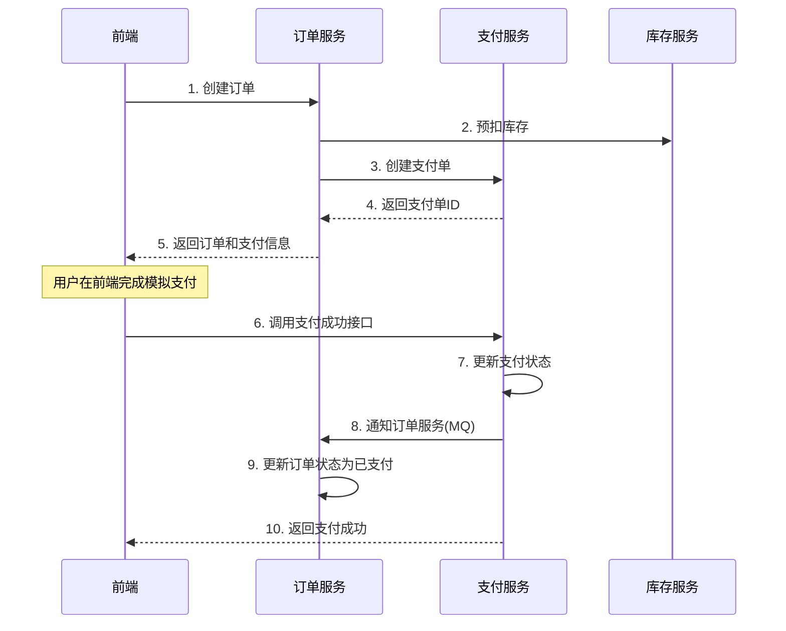

# 💳 支付服务 (payment-service)


## 📋 服务概述

支付服务是电商平台的核心服务之一，负责处理所有支付相关业务。本服务采用**简化支付模式**，适合快速部署和演示场景，通过前端直接触发支付成功/失败/退款，无需对接真实支付网关，降低开发和测试成本。

### 🎯 设计理念

- **简化开发流程**：无需配置支付宝/微信等第三方支付密钥
- **快速部署上线**：跳过繁琐的支付网关对接流程
- **完整业务闭环**：保留完整的支付状态流转和业务逻辑
- **易于测试验证**：前端可直接模拟各种支付场景
- **生产级架构**：使用分布式锁、缓存、异步处理等企业级方案

## ✨ 核心功能

### 📦 基础功能

1. **支付订单管理**：创建、查询、更新、取消支付订单
2. **支付流水记录**：完整的支付流水追踪和查询
3. **支付状态管理**：待支付、支付成功、支付失败、已退款等状态流转
4. **退款功能**：支持全额和部分退款
5. **支付统计**：支付数据统计和报表生成

### 🚀 高级特性

1. **分布式锁**：使用Redisson保证支付操作的并发安全
2. **Redis缓存**：单级Redis缓存提升查询性能
3. **异步处理**：多线程池异步处理支付相关任务
4. **风控检查**：支付前的风险控制和限额检查
5. **消息通知**：通过RocketMQ发送支付状态变更通知

## 🔄 简化支付流程

### 传统支付流程 vs 简化支付流程

#### ❌ 传统流程（复杂）

```
用户下单 → 创建支付订单 → 调用支付宝API → 用户扫码支付 → 支付宝回调 → 更新订单状态
需要：支付宝商户号、密钥、回调地址配置等
```

#### ✅ 简化流程（简单）

```
用户下单 → 创建支付订单 → 前端模拟支付 → 调用成功接口 → 更新订单状态
优势：无需支付网关配置，即可快速部署上线
```

### 🎬 支付流程说明



## 技术栈

- Spring Boot 3.5.3
- Spring Cloud 2025.0.0
- Spring Cloud Alibaba 2023.0.3.3
- MyBatis-Plus 3.5.13
- Redis 单机缓存
- 自定义线程池配置

## Redis缓存功能

### 缓存注解

支付服务实现了与stock服务相同的单Redis缓存注解：

#### @RedisCacheable

用于缓存查询结果，支持SpEL表达式和条件缓存：

```java
@RedisCacheable(
    cacheName = "payment", 
    key = "#paymentId", 
    expire = 1800,
    timeUnit = TimeUnit.SECONDS
)
public PaymentVO getPaymentById(Long paymentId) {
    // 方法实现
}
```

#### @RedisCachePut

用于更新缓存，总是执行方法并更新缓存：

```java
@RedisCachePut(
    cacheName = "payment", 
    key = "#result.paymentId",
    expire = 1800,
    timeUnit = TimeUnit.SECONDS
)
public PaymentVO updatePayment(PaymentUpdateDTO updateDTO) {
    // 方法实现
}
```

#### @RedisCacheEvict

用于删除缓存，支持条件删除和批量删除：

```java
@RedisCacheEvict(
    cacheName = "payment", 
    key = "#paymentId"
)
public void deletePayment(Long paymentId) {
    // 方法实现
}
```

### 缓存配置

- **缓存键前缀**: `payment-cache:`
- **默认过期时间**: 30分钟（1800秒）
- **支持SpEL表达式**: 支持复杂的键生成和条件判断
- **序列化方式**: JSON序列化

### 缓存策略

- **支付信息缓存**: `payment-cache:payment:{paymentId}`，过期时间30分钟
- **支付流水缓存**: `payment-cache:flow:{flowId}`，过期时间15分钟
- **用户支付列表缓存**: `payment-cache:userPayments:{userId}`，过期时间10分钟
- **支付统计缓存**: `payment-cache:statistics:{date}`，过期时间2小时

## 异步线程池配置

### 线程池类型

支付服务配置了多个专用线程池：

#### 1. 支付查询线程池 (paymentQueryExecutor)

```java
核心线程数: max(4, CPU核心数)
最大线程数: CPU核心数 × 3
队列容量: 300
线程名前缀: payment-query-
```

#### 2. 支付操作线程池 (paymentOperationExecutor)

```java
核心线程数: 3
最大线程数: 12
队列容量: 150
线程名前缀: payment-operation-
```

#### 3. 支付回调线程池 (paymentCallbackExecutor)

```java
核心线程数: 2
最大线程数: 8
队列容量: 100
线程名前缀: payment-callback-
```

#### 4. 支付通知线程池 (paymentNotificationExecutor)

```java
核心线程数: 2
最大线程数: 6
队列容量: 80
线程名前缀: payment-notification-
```

#### 5. 通用异步线程池 (paymentCommonAsyncExecutor)

```java
继承自BaseAsyncConfig的通用配置
核心线程数: 4
最大线程数: 8
队列容量: 100
线程名前缀: common-async-
```

### 异步方法使用示例

```java
@Async("paymentQueryExecutor")
public CompletableFuture<PaymentVO> queryPaymentAsync(Long paymentId) {
    PaymentVO payment = getPaymentById(paymentId);
    return CompletableFuture.completedFuture(payment);
}

@Async("paymentCallbackExecutor")
public void processPaymentCallback(PaymentCallbackDTO callback) {
    // 处理支付回调逻辑
}

@Async("paymentNotificationExecutor")  
public void sendPaymentNotification(PaymentNotificationDTO notification) {
    // 发送支付通知
}
```

## 🏛️ 服务接口

### 🔍 查询接口

| 方法 | 路径 | 描述 | 权限 |
|------|------|------|------|
| GET | `/payments` | 分页查询支付列表 | 用户/管理员 |
| GET | `/payments/{id}` | 根据支付ID查询详情 | 用户/管理员 |
| GET | `/payments/order/{orderId}` | 根据订单ID查询支付信息 | 用户/管理员 |

### ✏️ 操作接口

| 方法 | 路径 | 描述 | 权限 |
|------|------|------|------|
| POST | `/payments` | 创建支付订单 | 管理员 |
| PUT | `/payments/{id}` | 更新支付信息 | 管理员 |
| DELETE | `/payments/{id}` | 删除支付记录 | 管理员 |

### 💎 **核心支付接口（简化模式）**

| 方法 | 路径 | 描述 | 使用场景 |
|------|------|------|----------|
| POST | `/payments/{id}/success` | **支付成功** | 前端模拟支付成功时调用 |
| POST | `/payments/{id}/fail` | **支付失败** | 前端模拟支付失败时调用 |
| POST | `/payments/{id}/refund` | **申请退款** | 用户申请退款时调用 |

### 🛡️ 风控接口

| 方法 | 路径 | 描述 | 权限 |
|------|------|------|------|
| POST | `/payments/risk-check` | 支付风控检查 | 用户/管理员 |

## 📝 API使用示例

### 1. 创建支付订单

```bash
POST /payments
Content-Type: application/json
Authorization: Bearer {token}

{
  "orderId": 123456,
  "userId": 1001,
  "amount": 99.99,
  "channel": 1,
  "description": "购买商品"
}
```

### 2. 模拟支付成功（前端调用）

```bash
POST /payments/{paymentId}/success
Authorization: Bearer {token}

# 无需请求体，直接调用即可
```

**响应示例**：
```json
{
  "code": 200,
  "success": true,
  "message": "支付成功处理完成",
  "data": true,
  "timestamp": 1704067200000
}
```

### 3. 模拟支付失败（前端调用）

```bash
POST /payments/{paymentId}/fail?failReason=余额不足
Authorization: Bearer {token}
```

### 4. 申请退款（前端调用）

```bash
POST /payments/{paymentId}/refund?refundAmount=99.99&refundReason=用户取消订单
Authorization: Bearer {token}
```

### 5. 查询支付状态

```bash
GET /payments/{paymentId}
Authorization: Bearer {token}
```

**响应示例**：
```json
{
  "code": 200,
  "success": true,
  "message": "查询成功",
  "data": {
    "id": 1,
    "orderId": 123456,
    "userId": 1001,
    "amount": 99.99,
    "status": 2,
    "statusName": "支付成功",
    "channel": 1,
    "channelName": "支付宝",
    "createdAt": "2025-01-01 10:00:00",
    "paidAt": "2025-01-01 10:05:00"
  }
}
```

## 数据库设计

### 支付表 (tb_payment)

- `id`: 主键
- `payment_id`: 支付单号
- `order_id`: 关联订单ID
- `user_id`: 用户ID
- `amount`: 支付金额
- `payment_method`: 支付方式
- `payment_status`: 支付状态
- `third_party_id`: 第三方支付单号
- `callback_time`: 回调时间
- `create_time`: 创建时间
- `update_time`: 更新时间

## 分页查询实现

### MyBatis-Plus分页插件配置

项目使用MyBatis-Plus 3.5.13版本的分页插件，在`common-module`中统一配置：

```java
@Bean
public MybatisPlusInterceptor mybatisPlusInterceptor() {
    MybatisPlusInterceptor interceptor = new MybatisPlusInterceptor();
    // 分页插件（必须指定数据库类型）
    interceptor.addInnerInterceptor(new PaginationInnerInterceptor(DbType.MYSQL));
    // 乐观锁插件
    interceptor.addInnerInterceptor(new OptimisticLockerInnerInterceptor());
    // 防全表更新插件
    interceptor.addInnerInterceptor(new BlockAttackInnerInterceptor());
    return interceptor;
}
```

### 支付分页查询实现

#### 控制器层实现

```java
@PostMapping("/page")
public Result<Page<PaymentDTO>> getPayments(
        @RequestParam(defaultValue = "1") Integer page,
        @RequestParam(defaultValue = "10") Integer size,
        @RequestParam(required = false) Long userId,
        @RequestParam(required = false) Integer status,
        @RequestParam(required = false) Integer channel) {
    try {
        // 1. 构造分页对象
        Page<Payment> paymentPage = new Page<>(page, size);
        
        // 2. 构造查询条件
        LambdaQueryWrapper<Payment> queryWrapper = new LambdaQueryWrapper<>();
        if (userId != null) {
            queryWrapper.eq(Payment::getUserId, userId);
        }
        if (status != null) {
            queryWrapper.eq(Payment::getStatus, status);
        }
        if (channel != null) {
            queryWrapper.eq(Payment::getChannel, channel);
        }
        queryWrapper.orderByDesc(Payment::getCreatedAt);
        
        // 3. 执行分页查询
        Page<Payment> resultPage = paymentService.page(paymentPage, queryWrapper);
        
        // 4. 转换为DTO
        Page<PaymentDTO> dtoPage = new Page<>(resultPage.getCurrent(), resultPage.getSize(), resultPage.getTotal());
        List<PaymentDTO> dtoList = paymentConverter.toDTOList(resultPage.getRecords());
        dtoPage.setRecords(dtoList);
        
        return Result.success(dtoPage);
    } catch (Exception e) {
        log.error("分页查询支付记录异常", e);
        return Result.error("分页查询支付记录失败: " + e.getMessage());
    }
}
```

### 分页查询性能优化

1. **缓存策略**：对于热点查询条件的分页结果进行缓存
2. **索引优化**：为常用查询字段建立索引，如(user_id, status, created_at)
3. **异步分页**：对于大数据量分页查询，使用专用的查询线程池
4. **参数限制**：限制分页参数的合理范围，防止深度分页

### 支付流水表 (tb_payment_flow)

- `id`: 主键
- `flow_id`: 流水号
- `payment_id`: 关联支付ID
- `flow_type`: 流水类型
- `amount`: 金额
- `status`: 状态
- `remark`: 备注
- `create_time`: 创建时间

## 使用说明

### 1. 启用Redis缓存

在Service类上使用缓存注解：

```java
@Service
@RequiredArgsConstructor
public class PaymentServiceImpl implements PaymentService {

    @RedisCacheable(cacheName = "payment", key = "#paymentId")
    @Override
    public PaymentVO getPaymentById(Long paymentId) {
        // 实现逻辑
    }
    
    @RedisCacheEvict(cacheName = "payment", key = "#paymentId")
    @Override 
    public void deletePayment(Long paymentId) {
        // 实现逻辑
    }
}
```

### 2. 使用异步处理

在Controller或Service中使用异步方法：

```java
@RestController
@RequiredArgsConstructor
public class PaymentController {
    
    private final PaymentService paymentService;
    
    @GetMapping("/async/{paymentId}")
    public CompletableFuture<Result<PaymentVO>> getPaymentAsync(@PathVariable Long paymentId) {
        return paymentService.queryPaymentAsync(paymentId)
                .thenApply(payment -> Result.success(payment));
    }
}
```

### 3. 配置自定义线程池

如需要自定义线程池配置，可以重写配置方法：

```java
@Configuration
public class CustomPaymentAsyncConfig extends PaymentAsyncConfig {
    
    @Bean("customPaymentExecutor")
    @Override
    public Executor paymentOperationExecutor() {
        return createThreadPoolTaskExecutor(5, 20, 200, "custom-payment-");
    }
}
```

## 监控与日志

- 所有缓存操作都有详细的DEBUG级别日志
- 线程池状态可通过Actuator端点监控
- 异步任务执行情况可通过日志跟踪
- 支付相关操作都有完整的审计日志

## 🚀 部署说明

### 环境要求

| 组件 | 版本 | 必需 | 说明 |
|------|------|------|------|
| JDK | 17+ | ✅ | Java运行环境 |
| MySQL | 8.0+ | ✅ | 数据存储 |
| Redis | 7.0+ | ✅ | 缓存服务 |
| Nacos | 2.4.0+ | ✅ | 注册中心 |
| RocketMQ | 5.3.2+ | ✅ | 消息队列 |

### 启动步骤

1. **初始化数据库**
```bash
# 运行数据库脚本
mysql -u root -p < sql/init/initdb_payment.sql
```

2. **配置环境变量**
```yaml
# application.yml
spring:
  datasource:
    url: jdbc:mysql://localhost:3306/cloud_payment
    username: root
    password: your_password
  
  redis:
    host: localhost
    port: 6379
    password: your_redis_password
  
  cloud:
    nacos:
      server-addr: localhost:8848
```

3. **启动服务**
```bash
# Maven启动
mvn spring-boot:run

# 或者打包后启动
mvn clean package -DskipTests
java -jar target/payment-service-1.0.0.jar
```

4. **验证服务**
```bash
# 检查健康状态
curl http://localhost:8086/actuator/health

# 查看API文档
http://localhost:8086/doc.html
```

### Docker部署

```bash
# 构建Docker镜像
docker build -t cloud-payment-service:1.0.0 .

# 运行容器
docker run -d \
  --name payment-service \
  -p 8086:8086 \
  -e SPRING_DATASOURCE_URL=jdbc:mysql://mysql:3306/cloud_payment \
  -e SPRING_REDIS_HOST=redis \
  -e SPRING_CLOUD_NACOS_SERVER_ADDR=nacos:8848 \
  cloud-payment-service:1.0.0
```

## ⚠️ 注意事项

### 开发注意事项

1. **缓存使用**：缓存注解必须在Spring管理的Bean中使用
2. **异步调用**：异步方法不能在同一个类中调用，需要通过依赖注入
3. **配置管理**：Redis、MySQL、Nacos配置需要在application.yml中正确配置
4. **性能调优**：线程池配置需要根据实际业务量调整
5. **幂等性**：支付成功/失败/退款接口已增加分布式锁保证幂等性
6. **数据一致性**：缓存更新和删除需要与业务操作保持一致性

### 生产环境建议

1. **简化支付模式**：本服务采用简化支付流程，适合快速部署、演示和测试场景
2. **真实支付集成**：如需集成真实支付网关（支付宝/微信），可参考`AlipayController`进行扩展
3. **数据备份**：建议定期备份支付数据库
4. **监控告警**：配置支付失败率、退款率等关键指标监控
5. **安全防护**：启用支付风控检查，防止异常支付行为

## 📊 监控指标

### Actuator端点

- `/actuator/health` - 健康检查
- `/actuator/metrics` - 指标收集
- `/actuator/prometheus` - Prometheus格式指标

### 关键业务指标

- 支付成功率：`payment_success_rate`
- 支付平均响应时间：`payment_response_time`
- 退款率：`refund_rate`
- 风控拦截数：`risk_blocked_count`

## 📚 相关文档

- [RULE.md](../RULE.md) - 开发规范
- [README.md](../README.md) - 项目总体介绍
- [API文档](http://localhost:8086/doc.html) - Knife4j API文档

## 🤝 贡献指南

欢迎提交Issue和Pull Request，请遵循项目的开发规范。

## 📄 许可证

本项目采用 Apache License 2.0 许可证。

---

**❤️ 如果这个服务对您有帮助，请给项目点个 Star！**
