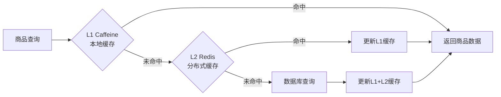

# 商品服务开发文档

## 项目概述

商品服务 (product-service) 是云商城微服务架构中的核心业务服务，负责商品信息管理、分类管理、库存查询等功能，采用多级缓存策略优化热点商品访问性能。

### 主要功能

- 商品信息管理 (CRUD操作)
- 商品分类管理 (树形结构)
- 商品搜索和筛选
- 商品图片管理 (MinIO集成)
- 商品状态管理 (上架/下架)
- 商品事件消息发布
- 热点商品缓存优化

## 技术栈

### 核心框架

- **Spring Boot**: 3.5.3
- **Spring Cloud**: 2025.0.0
- **Spring Cloud Alibaba**: 2025.0.0.0-preview
- **Spring Security OAuth2**: 资源服务器
- **Java版本**: 17 LTS

### 依赖版本

```xml
<spring-boot.version>3.5.3</spring-boot.version>
<spring-cloud.version>2025.0.0</spring-cloud.version>
<spring-cloud-alibaba.version>2025.0.0.0-preview</spring-cloud-alibaba.version>
<java.version>17</java.version>
<mybatis-plus.version>3.5.13</mybatis-plus.version>
```

### 数据存储

- **MySQL**: 8.0+ (商品信息存储，数据库: product_db)
- **Redis**: 7.0+ (L2分布式缓存，数据库3)
- **Caffeine**: L1本地缓存 (15分钟/1小时策略)
- **MinIO**: 对象存储 (商品图片，端口: 9000)
- **RocketMQ**: 5.3.2 (商品事件消息，端口: 39876)

## 多级缓存架构

### 缓存策略

商品服务采用 **L1(Caffeine) + L2(Redis)** 多级缓存策略，针对热点商品优化：

- **L1 本地缓存**: 15分钟 TTL，热点商品数据
- **L2 分布式缓存**: 1小时 TTL，商品详情缓存
- **缓存预热**: 系统启动时预加载热门商品
- **缓存穿透保护**: 空结果缓存，防止恶意查询



## 服务配置

### 服务基本信息

- **服务名称**: product-service
- **运行端口**: 8082
- **数据库**: product_db (MySQL)
- **Redis数据库**: 3 (商品缓存专用)
- **认证方式**: OAuth2.1 JWT
- **文件存储**: MinIO (商品图片)

### 关键配置

```yaml
server:
  port: 8082

spring:
  application:
    name: product-service
  datasource:
    driver-class-name: com.mysql.cj.jdbc.Driver
    url: jdbc:mysql://localhost:3306/product_db?useUnicode=true&characterEncoding=utf8&serverTimezone=GMT%2B8
    username: root
    password: root
  security:
    oauth2:
      resourceserver:
        jwt:
          jwk-set-uri: http://127.0.0.1:80/.well-known/jwks.json
          cache-duration: PT30M
  data:
    redis:
      host: localhost
      port: 6379
      password: root
      database: 3  # 商品服务专用Redis数据库
      timeout: 10000ms
  cloud:
    stream:
      rocketmq:
        binder:
          name-server: 127.0.0.1:39876
      bindings:
        product-producer-out-0:
          destination: product-events
          content-type: application/json
          group: product-producer-group

# MinIO 对象存储配置
minio:
  endpoint: http://localhost:9000
  access-key: minioadmin
  secret-key: minioadmin
  bucket-name: product-images
  public-endpoint: http://localhost:9000
```

## 数据库设计

### 商品信息表 (products)

```sql
CREATE TABLE `products` (
  `id` bigint NOT NULL AUTO_INCREMENT COMMENT '商品ID',
  `product_name` varchar(255) NOT NULL COMMENT '商品名称',
  `product_code` varchar(50) UNIQUE NOT NULL COMMENT '商品编码',
  `category_id` bigint NOT NULL COMMENT '分类ID',
  `brand_name` varchar(100) COMMENT '品牌名称',
  `description` text COMMENT '商品描述',
  `main_image` varchar(255) COMMENT '主图URL',
  `image_list` json COMMENT '图片列表',
  `price` decimal(10,2) NOT NULL COMMENT '售价',
  `original_price` decimal(10,2) COMMENT '原价',
  `cost_price` decimal(10,2) COMMENT '成本价',
  `stock_quantity` int NOT NULL DEFAULT 0 COMMENT '库存数量',
  `sales_count` int NOT NULL DEFAULT 0 COMMENT '销量',
  `view_count` int NOT NULL DEFAULT 0 COMMENT '浏览量',
  `status` tinyint NOT NULL DEFAULT 1 COMMENT '状态：0-下架，1-上架',
  `is_hot` tinyint NOT NULL DEFAULT 0 COMMENT '是否热销',
  `is_new` tinyint NOT NULL DEFAULT 0 COMMENT '是否新品',
  `is_recommend` tinyint NOT NULL DEFAULT 0 COMMENT '是否推荐',
  `sort_order` int NOT NULL DEFAULT 0 COMMENT '排序字段',
  `seo_title` varchar(255) COMMENT 'SEO标题',
  `seo_keywords` varchar(500) COMMENT 'SEO关键词',
  `seo_description` text COMMENT 'SEO描述',
  `created_time` datetime NOT NULL DEFAULT CURRENT_TIMESTAMP,
  `updated_time` datetime NOT NULL DEFAULT CURRENT_TIMESTAMP ON UPDATE CURRENT_TIMESTAMP,
  `deleted` tinyint NOT NULL DEFAULT 0 COMMENT '逻辑删除',
  `version` bigint NOT NULL DEFAULT 1 COMMENT '乐观锁版本号',
  PRIMARY KEY (`id`),
  UNIQUE KEY `uk_product_code` (`product_code`),
  KEY `idx_category_id` (`category_id`),
  KEY `idx_brand_name` (`brand_name`),
  KEY `idx_status` (`status`),
  KEY `idx_is_hot` (`is_hot`),
  KEY `idx_price` (`price`),
  KEY `idx_sales_count` (`sales_count`),
  KEY `idx_sort_order` (`sort_order`)
) ENGINE=InnoDB DEFAULT CHARSET=utf8mb4 COMMENT='商品信息表';
```

### 商品分类表 (product_categories)

```sql
CREATE TABLE `product_categories` (
  `id` bigint NOT NULL AUTO_INCREMENT COMMENT '分类ID',
  `parent_id` bigint NOT NULL DEFAULT 0 COMMENT '父级分类ID',
  `category_name` varchar(100) NOT NULL COMMENT '分类名称',
  `category_code` varchar(50) UNIQUE NOT NULL COMMENT '分类编码',
  `category_icon` varchar(255) COMMENT '分类图标',
  `category_image` varchar(255) COMMENT '分类图片',
  `description` text COMMENT '分类描述',
  `level` tinyint NOT NULL DEFAULT 1 COMMENT '分类层级',
  `sort_order` int NOT NULL DEFAULT 0 COMMENT '排序字段',
  `is_visible` tinyint NOT NULL DEFAULT 1 COMMENT '是否显示',
  `created_time` datetime NOT NULL DEFAULT CURRENT_TIMESTAMP,
  `updated_time` datetime NOT NULL DEFAULT CURRENT_TIMESTAMP ON UPDATE CURRENT_TIMESTAMP,
  `deleted` tinyint NOT NULL DEFAULT 0 COMMENT '逻辑删除',
  PRIMARY KEY (`id`),
  UNIQUE KEY `uk_category_code` (`category_code`),
  KEY `idx_parent_id` (`parent_id`),
  KEY `idx_level` (`level`),
  KEY `idx_sort_order` (`sort_order`)
) ENGINE=InnoDB DEFAULT CHARSET=utf8mb4 COMMENT='商品分类表';
```

## 商品事件系统

### 支持的事件类型

| 事件类型 | Tag标签 | 触发场景 | 说明 |
|----------|---------|----------|------|
| PRODUCT_CREATED | product-created | 商品创建 | 新商品添加成功 |
| PRODUCT_UPDATED | product-updated | 商品信息更新 | 商品详情修改 |
| PRODUCT_STATUS_CHANGED | product-status-changed | 商品状态变更 | 上架/下架操作 |
| PRODUCT_PRICE_CHANGED | product-price-changed | 价格调整 | 商品价格变动 |
| PRODUCT_STOCK_CHANGED | product-stock-changed | 库存变化 | 库存增减操作 |
| PRODUCT_VIEW_INCREMENTED | product-view-incremented | 浏览量增加 | 商品查看次数 |
| PRODUCT_DELETED | product-deleted | 商品删除 | 商品逻辑删除 |

### 事件生产者配置

```yaml
spring:
  cloud:
    stream:
      rocketmq:
        binder:
          name-server: 127.0.0.1:39876
      bindings:
        product-producer-out-0:
          destination: product-events
          content-type: application/json
          group: product-producer-group
```

## API设计

### 商品管理接口

#### 商品基础接口
- **GET** `/api/product/list` - 商品列表查询 (支持分页、筛选)
- **GET** `/api/product/{id}` - 商品详情查询
- **GET** `/api/product/search` - 商品搜索
- **GET** `/api/product/category/{categoryId}` - 按分类查询商品
- **GET** `/api/product/hot` - 热销商品列表
- **GET** `/api/product/recommend` - 推荐商品列表

#### 商品管理接口 (需要管理员权限)
- **POST** `/api/product/admin/products` - 创建商品
- **PUT** `/api/product/admin/products/{id}` - 更新商品信息
- **PUT** `/api/product/admin/products/{id}/status` - 修改商品状态
- **DELETE** `/api/product/admin/products/{id}` - 删除商品
- **POST** `/api/product/admin/products/{id}/images` - 上传商品图片

#### 分类管理接口
- **GET** `/api/product/categories` - 获取分类树
- **POST** `/api/product/admin/categories` - 创建分类
- **PUT** `/api/product/admin/categories/{id}` - 更新分类
- **DELETE** `/api/product/admin/categories/{id}` - 删除分类

### 权限控制

```java
@RestController
@RequestMapping("/api/product")
public class ProductController {
    
    @GetMapping("/{id}")
    @PreAuthorize("hasAuthority('product.read')")
    public Result<ProductVO> getProduct(@PathVariable Long id) {
        // 查询商品详情，增加浏览量，发送VIEW_INCREMENTED事件
        return Result.success(productService.getProductById(id));
    }
    
    @PostMapping("/admin/products")
    @PreAuthorize("hasRole('ADMIN') and hasAuthority('product.write')")
    public Result<Long> createProduct(@Valid @RequestBody ProductCreateDTO dto) {
        // 创建商品，发送PRODUCT_CREATED事件
        return Result.success(productService.createProduct(dto));
    }
    
    @PutMapping("/admin/products/{id}/status")
    @PreAuthorize("hasRole('ADMIN') and hasAuthority('product.manage')")
    public Result<Void> updateStatus(@PathVariable Long id, @RequestBody ProductStatusDTO dto) {
        // 更新商品状态，清除缓存，发送STATUS_CHANGED事件
        productService.updateProductStatus(id, dto.getStatus());
        return Result.success();
    }
}
```

## 商品图片管理

### MinIO 集成

商品图片存储使用 MinIO 对象存储：

```java
@Service
public class ProductImageService {
    
    public List<String> uploadProductImages(Long productId, List<MultipartFile> files) {
        List<String> imageUrls = new ArrayList<>();
        
        for (MultipartFile file : files) {
            // 1. 验证图片文件
            validateImageFile(file);
            
            // 2. 生成文件名
            String fileName = generateImageFileName(productId, file);
            
            // 3. 上传到MinIO
            String imageUrl = minioService.uploadFile("product-images", fileName, file);
            imageUrls.add(imageUrl);
        }
        
        // 4. 更新商品图片列表
        productService.updateProductImages(productId, imageUrls);
        
        // 5. 清除商品缓存
        productCacheService.evictProductCache(productId);
        
        // 6. 发送更新事件
        productEventProducer.sendProductUpdatedEvent(productId);
        
        return imageUrls;
    }
}
```

## 商品搜索优化

### 搜索功能实现

```java
@Service
public class ProductSearchService {
    
    public PageResult<ProductVO> searchProducts(ProductSearchDTO searchDto) {
        // 构建查询条件
        QueryWrapper<Product> queryWrapper = new QueryWrapper<>();
        
        // 关键词搜索 (商品名称、描述)
        if (StringUtils.hasText(searchDto.getKeyword())) {
            queryWrapper.and(wrapper -> wrapper
                .like("product_name", searchDto.getKeyword())
                .or()
                .like("description", searchDto.getKeyword())
            );
        }
        
        // 分类筛选
        if (searchDto.getCategoryId() != null) {
            queryWrapper.eq("category_id", searchDto.getCategoryId());
        }
        
        // 价格区间筛选
        if (searchDto.getMinPrice() != null) {
            queryWrapper.ge("price", searchDto.getMinPrice());
        }
        if (searchDto.getMaxPrice() != null) {
            queryWrapper.le("price", searchDto.getMaxPrice());
        }
        
        // 排序
        applySorting(queryWrapper, searchDto.getSortBy());
        
        // 只查询上架商品
        queryWrapper.eq("status", 1).eq("deleted", 0);
        
        // 分页查询
        Page<Product> page = productMapper.selectPage(
            new Page<>(searchDto.getPageNum(), searchDto.getPageSize()),
            queryWrapper
        );
        
        return PageResult.of(page, productConverter::toVO);
    }
}
```

## 缓存管理

### 热点商品缓存策略

```java
@Service
public class ProductCacheService {
    
    @Cacheable(value = "product:detail", key = "#id", 
               cacheManager = "multiLevelCacheManager")
    public ProductVO getProductFromCache(Long id) {
        Product product = productMapper.selectById(id);
        return productConverter.toVO(product);
    }
    
    @CacheEvict(value = "product:detail", key = "#id")
    public void evictProductCache(Long id) {
        log.info("清除商品缓存: productId={}", id);
    }
    
    @Cacheable(value = "product:category", key = "#categoryId")
    public List<ProductVO> getProductsByCategory(Long categoryId) {
        List<Product> products = productMapper.selectList(
            new QueryWrapper<Product>()
                .eq("category_id", categoryId)
                .eq("status", 1)
                .orderByDesc("sort_order", "sales_count")
        );
        return products.stream()
            .map(productConverter::toVO)
            .collect(Collectors.toList());
    }
}
```

## 监控和运维

### 关键监控指标

- 商品查询响应时间
- 缓存命中率 (L1/L2)
- 热点商品访问量
- 商品搜索性能
- 图片上传成功率
- 数据库连接池状态

### API 文档配置

```yaml
springdoc:
  group-configs:
    - group: 'product-query'     # 商品查询接口
      paths-to-match: '/api/product/**'
      packages-to-scan: com.cloud.product.controller.query
    - group: 'product-manage'    # 商品管理接口
      paths-to-match: '/api/product/admin/**'
      packages-to-scan: com.cloud.product.controller.admin
    - group: 'category-manage'   # 分类管理接口
      paths-to-match: '/api/product/categories/**'
      packages-to-scan: com.cloud.product.controller.category
```

## 测试指南

### API 测试

通过网关统一入口测试：
- **Knife4j文档**: http://localhost/doc.html
- **商品组接口**: 选择"商品服务"分组
- **图片上传测试**: 使用Postman上传多个文件

### 性能测试

```bash
# 商品详情查询性能测试
wrk -t12 -c400 -d30s http://localhost/api/product/1

# 商品搜索性能测试
wrk -t8 -c200 -d30s "http://localhost/api/product/search?keyword=手机"

# 分类商品查询测试
ab -n 10000 -c 100 http://localhost/api/product/category/1
```

### 缓存测试

1. **缓存命中测试**: 重复查询同一商品，观察响应时间
2. **缓存失效测试**: 更新商品信息后验证缓存清除
3. **热点商品测试**: 模拟高并发访问热门商品
4. **分类缓存测试**: 验证分类商品列表缓存效果

## 故障排查

### 常见问题

1. **商品查询缓慢**:
   - 检查数据库索引是否生效
   - 验证缓存配置和命中率
   - 分析查询SQL的执行计划

2. **图片上传失败**:
   - 验证MinIO服务状态
   - 检查文件大小和格式限制
   - 确认存储桶权限配置

3. **搜索功能异常**:
   - 检查搜索关键词和条件构造
   - 验证数据库字段索引
   - 确认分页参数设置

4. **缓存数据不一致**:
   - 检查缓存更新和清除逻辑
   - 验证Redis连接状态
   - 确认缓存键命名规范

---

**更新时间**: 2025/9/23  
**版本**: v1.0.0  
**更新内容**: 商品服务完整实现文档，包含多级缓存、事件系统、图片存储、搜索优化等
