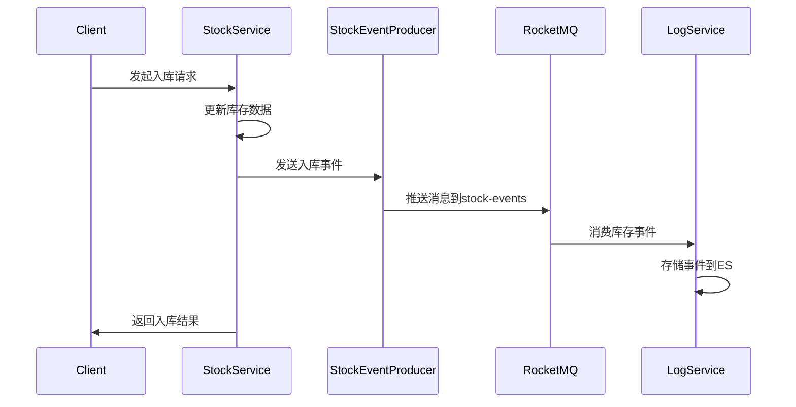
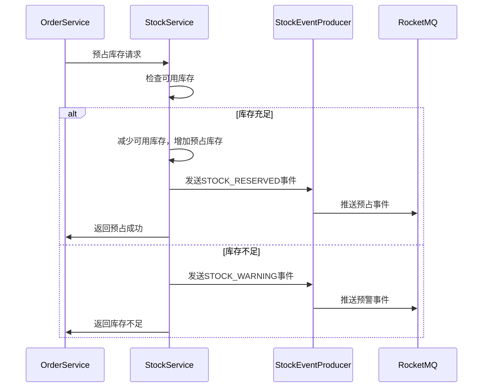

# 库存服务开发文档

## 1. 项目概述

库存服务(stock-service)是云商城微服务架构中的核心服务之一，负责商品库存管理、库存变更追踪和库存事件通知。

### 1.1 主要功能

- 商品库存查询和管理
- 库存入库、出库操作
- 库存预占和释放
- 库存锁定和解锁
- 库存调整和盘点
- 库存事件消息生产

### 1.2 技术栈

- Spring Boot 2.7.x
- Spring Cloud 2021.x
- RocketMQ 4.9.x
- MySQL 8.0
- MyBatis Plus
- Redis 6.0

## 2. 库存事件系统

### 2.1 事件类型

库存服务支持以下类型的事件：

```java
public enum StockEventType {
    STOCK_IN,           // 入库
    STOCK_OUT,          // 出库  
    STOCK_RESERVED,     // 预占
    STOCK_RELEASED,     // 释放
    STOCK_LOCKED,       // 锁定
    STOCK_UNLOCKED,     // 解锁
    STOCK_ADJUSTED,     // 调整
    STOCK_TRANSFERRED,  // 转移
    STOCK_FROZEN,       // 冻结
    STOCK_UNFROZEN,     // 解冻
    STOCK_SCRAPED,      // 报废
    STOCK_WARNING,      // 预警
    STOCK_SYNC          // 同步
}
```

### 2.2 核心组件

#### 2.2.1 事件模型 (StockChangeEvent)

位置：`common/src/main/java/com/cloud/common/model/event/StockChangeEvent.java`

```java
@Data
@AllArgsConstructor
@NoArgsConstructor
public class StockChangeEvent {
    private String eventId;
    private String eventType;
    private Long userId;
    private Long productId;
    private String productSku;
    private String productName;
    private Integer quantity;
    private Integer beforeQuantity;
    private Integer afterQuantity;
    private String warehouseId;
    private String warehouseName;
    private String reason;
    private String source;
    private String orderId;
    private String operationType;
    private String operatorId;
    private String operatorName;
    private String clientIp;
    private String userAgent;
    private String deviceId;
    private Map<String, Object> metadata;
    private LocalDateTime timestamp;
    private Long version;
}
```

#### 2.2.2 事件生产者 (StockEventProducer)

位置：`stock-service/src/main/java/com/cloud/stock/messaging/StockEventProducer.java`

```java
@Component
@Slf4j
public class StockEventProducer {
    
    @Autowired
    private StreamBridge streamBridge;
    
    private static final String OUTPUT_BINDING = "stockProducer-out-0";
    
    public void sendStockInEvent(StockChangeEvent event) {
        sendEvent(event, StockEventType.STOCK_IN.name());
    }
    
    public void sendStockOutEvent(StockChangeEvent event) {
        sendEvent(event, StockEventType.STOCK_OUT.name());
    }
    
    // ... 其他事件发送方法
    
    private void sendEvent(StockChangeEvent event, String eventType) {
        try {
            event.setEventType(eventType);
            event.setTimestamp(LocalDateTime.now());
            
            Message<StockChangeEvent> message = MessageBuilder
                .withPayload(event)
                .setHeader("eventType", eventType)
                .setHeader("productId", event.getProductId())
                .setHeader("warehouseId", event.getWarehouseId())
                .build();
            
            boolean sent = streamBridge.send(OUTPUT_BINDING, message);
            if (sent) {
                log.info("库存事件发送成功: eventType={}, productId={}, eventId={}", 
                    eventType, event.getProductId(), event.getEventId());
            } else {
                log.error("库存事件发送失败: eventType={}, productId={}, eventId={}", 
                    eventType, event.getProductId(), event.getEventId());
            }
        } catch (Exception e) {
            log.error("库存事件发送异常: eventType={}, productId={}, error={}", 
                eventType, event.getProductId(), e.getMessage(), e);
        }
    }
}
```

### 2.3 RocketMQ配置

#### 2.3.1 生产者配置

位置：`stock-service/src/main/resources/application-rocketmq.yml`

```yaml
spring:
  cloud:
    stream:
      function:
        definition: stockProducer
      bindings:
        stockProducer-out-0:
          destination: stock-events
          content-type: application/json
          producer:
            partitionCount: 3
      rocketmq:
        binder:
          name-server: localhost:9876
        bindings:
          stockProducer-out-0:
            producer:
              sync: true
              sendMessageTimeout: 3000
              maxMessageSize: 4194304
              retryTimesWhenSendFailed: 2
```

### 2.4 事件监听和消费

库存事件由日志服务(log-service)消费，用于事件存储、搜索和分析。消费者配置和处理逻辑请参考日志服务开发文档。

## 3. API设计

### 3.1 库存查询接口

```java
@GetMapping("/stock/{productId}")
public Result<StockInfo> getStock(@PathVariable Long productId) {
    // 查询商品库存信息
}

@GetMapping("/stock/batch")
public Result<List<StockInfo>> getBatchStock(@RequestParam List<Long> productIds) {
    // 批量查询库存信息
}
```

### 3.2 库存操作接口

```java
@PostMapping("/stock/in")
public Result<Void> stockIn(@RequestBody StockInRequest request) {
    // 入库操作
    // 发送STOCK_IN事件
}

@PostMapping("/stock/out") 
public Result<Void> stockOut(@RequestBody StockOutRequest request) {
    // 出库操作
    // 发送STOCK_OUT事件
}

@PostMapping("/stock/reserve")
public Result<Void> reserveStock(@RequestBody StockReserveRequest request) {
    // 预占库存
    // 发送STOCK_RESERVED事件
}

@PostMapping("/stock/release")
public Result<Void> releaseStock(@RequestBody StockReleaseRequest request) {
    // 释放预占库存
    // 发送STOCK_RELEASED事件
}
```

## 4. 数据库设计

### 4.1 库存表 (stock_info)

```sql
CREATE TABLE `stock_info` (
  `id` bigint NOT NULL AUTO_INCREMENT COMMENT '主键ID',
  `product_id` bigint NOT NULL COMMENT '商品ID',
  `product_sku` varchar(100) NOT NULL COMMENT '商品SKU',
  `warehouse_id` varchar(50) NOT NULL COMMENT '仓库ID',
  `available_quantity` int NOT NULL DEFAULT 0 COMMENT '可用库存',
  `reserved_quantity` int NOT NULL DEFAULT 0 COMMENT '预占库存',
  `locked_quantity` int NOT NULL DEFAULT 0 COMMENT '锁定库存',
  `frozen_quantity` int NOT NULL DEFAULT 0 COMMENT '冻结库存',
  `total_quantity` int NOT NULL DEFAULT 0 COMMENT '总库存',
  `alert_quantity` int NOT NULL DEFAULT 0 COMMENT '预警库存',
  `version` bigint NOT NULL DEFAULT 1 COMMENT '版本号',
  `created_time` datetime NOT NULL DEFAULT CURRENT_TIMESTAMP COMMENT '创建时间',
  `updated_time` datetime NOT NULL DEFAULT CURRENT_TIMESTAMP ON UPDATE CURRENT_TIMESTAMP COMMENT '更新时间',
  `is_deleted` tinyint NOT NULL DEFAULT 0 COMMENT '是否删除',
  PRIMARY KEY (`id`),
  UNIQUE KEY `uk_product_warehouse` (`product_id`, `warehouse_id`, `is_deleted`),
  KEY `idx_product_id` (`product_id`),
  KEY `idx_warehouse_id` (`warehouse_id`)
) ENGINE=InnoDB DEFAULT CHARSET=utf8mb4 COMMENT='库存信息表';
```

### 4.2 库存变更记录表 (stock_change_log)

```sql
CREATE TABLE `stock_change_log` (
  `id` bigint NOT NULL AUTO_INCREMENT COMMENT '主键ID',
  `product_id` bigint NOT NULL COMMENT '商品ID',
  `product_sku` varchar(100) NOT NULL COMMENT '商品SKU',
  `warehouse_id` varchar(50) NOT NULL COMMENT '仓库ID',
  `change_type` varchar(50) NOT NULL COMMENT '变更类型',
  `quantity` int NOT NULL COMMENT '变更数量',
  `before_quantity` int NOT NULL COMMENT '变更前数量',
  `after_quantity` int NOT NULL COMMENT '变更后数量',
  `reason` varchar(200) COMMENT '变更原因',
  `order_id` varchar(50) COMMENT '关联订单ID',
  `operator_id` varchar(50) COMMENT '操作人ID',
  `operator_name` varchar(100) COMMENT '操作人姓名',
  `client_ip` varchar(50) COMMENT '客户端IP',
  `user_agent` varchar(500) COMMENT '用户代理',
  `created_time` datetime NOT NULL DEFAULT CURRENT_TIMESTAMP COMMENT '创建时间',
  PRIMARY KEY (`id`),
  KEY `idx_product_id` (`product_id`),
  KEY `idx_change_type` (`change_type`),
  KEY `idx_created_time` (`created_time`)
) ENGINE=InnoDB DEFAULT CHARSET=utf8mb4 COMMENT='库存变更日志表';
```

## 5. 核心业务流程

### 5.1 库存入库流程



### 5.2 库存预占流程



## 6. 监控和日志

### 6.1 关键指标监控

- 库存操作成功率
- 库存预占命中率
- 库存预警频率
- 事件发送成功率
- 消息队列延迟

### 6.2 日志配置

```yaml
logging:
  level:
    com.cloud.stock: INFO
    com.cloud.stock.messaging: DEBUG
    org.springframework.cloud.stream: DEBUG
```

## 7. 测试

### 7.1 单元测试

- StockService业务逻辑测试
- StockEventProducer事件发送测试
- 库存并发操作测试

### 7.2 集成测试

- 库存操作端到端测试
- 事件消息流测试
- 与其他服务交互测试

### 7.3 性能测试

- 高并发库存操作测试
- 消息发送性能测试
- 数据库操作性能测试

## 8. 部署和运维

### 8.1 环境要求

- JDK 1.8+
- MySQL 8.0+
- Redis 6.0+
- RocketMQ 4.9+

### 8.2 配置文件

- application.yml: 基础配置
- application-rocketmq.yml: 消息队列配置
- application-dev/test/prod.yml: 环境相关配置

### 8.3 启动命令

```bash
java -jar stock-service.jar --spring.profiles.active=prod
```

## 9. 故障排查

### 9.1 常见问题

1. 库存数据不一致: 检查数据库事务和版本号机制
2. 事件消息丢失: 检查RocketMQ连接和配置
3. 库存操作超时: 检查数据库连接池和索引

### 9.2 日志分析

- 查看库存操作日志
- 分析事件发送日志
- 监控消息队列状态

## 10. 版本更新记录

### v1.0.0 (2024-01-20)

- 初始版本发布
- 基础库存管理功能
- 库存事件消息系统
- RocketMQ集成
- 完整的监控和日志体系
