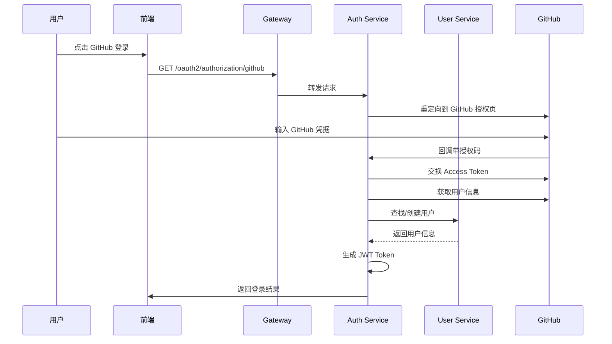

# 用户服务 (user-service)

## 1. 模块概述

用户服务是电商平台系统中的核心服务之一，负责管理用户信息、用户地址、用户头像等与用户相关的功能。该服务基于Spring Boot和Spring
Cloud构建，采用微服务架构设计，支持高并发访问和水平扩展。

### 1.1 核心功能

- 用户注册与登录
- **GitHub OAuth2.1 登录支持** ✨
- 用户信息管理
- 用户地址管理
- 用户头像上传与管理
- 用户权限控制
- 用户数据缓存优化
- 用户变更事件发布(基于RocketMQ)

### 1.2 技术栈

- **核心框架**: Spring Boot 3.5.3, Spring Cloud 2025.0.0
- **安全框架**: Spring Security, OAuth2 Resource Server
- **数据库**: MySQL 9.3.0, MyBatis-Plus 3.5.13
- **缓存**: Redis 8.2-rc1
- **对象存储**: MinIO
- **API文档**: Swagger/OpenAPI 3.0, Knife4j
- **服务治理**: Nacos 3.0.2
- **对象映射**: MapStruct 1.6.3
- **消息队列**: RocketMQ 5.3.2, Spring Cloud Stream
- **其他**: Lombok

## 2. 服务架构

### 2.1 整体架构

用户服务采用经典的分层架构模式，从上到下分为：

```
┌─────────────────────────────────────────────────────────────┐
│                      API Controller Layer                   │
├─────────────────────────────────────────────────────────────┤
│                        Service Layer                        │
├─────────────────────────────────────────────────────────────┤
│                     Data Access Layer                       │
├─────────────────────────────────────────────────────────────┤
│                      Database Layer                         │
└─────────────────────────────────────────────────────────────┘
```

### 2.2 模块结构

```
user-service/
├── src/main/java/com/cloud/user/
│   ├── UserApplication.java              # 启动类
│   ├── config/                          # 配置类
│   ├── controller/                      # 控制器层
│   ├── converter/                       # 对象转换器
│   ├── exception/                       # 异常处理
│   ├── interceptor/                     # 拦截器
│   ├── mapper/                          # 数据访问层
│   ├── module/entity/                   # 实体类
│   └── service/                         # 业务逻辑层
│       └── impl/                        # 业务逻辑实现
├── src/main/resources/
│   ├── mapper/                          # MyBatis XML映射文件
│   ├── application.yml                  # 主配置文件
│   └── application-dev.yml              # 开发环境配置
└── src/test/java/com/cloud/user/        # 测试代码
```

## 3. 核心功能详解

### 3.1 用户管理

#### 3.1.1 用户注册

用户可以通过提供用户名、密码、手机号等信息进行注册。系统会对用户名进行唯一性校验，并对密码进行BCrypt加密存储。

#### 3.1.2 用户信息管理

支持用户信息的查询、更新操作。用户可以修改昵称、手机号、邮箱等信息。管理员可以对用户进行启用、禁用、删除等操作。

#### 3.1.3 用户权限控制

基于Spring Security和OAuth2实现细粒度的权限控制：

- 普通用户只能操作自己的信息
- 管理员可以操作所有用户信息
- 不同角色具有不同的操作权限

### 3.2 地址管理

#### 3.2.1 地址添加

用户可以添加多个收货地址，包括收货人姓名、手机号、详细地址等信息。

#### 3.2.2 地址维护

支持地址的查询、更新、删除操作，并提供权限验证，确保用户只能操作自己的地址。

### 3.3 头像管理

#### 3.3.1 头像上传

支持用户上传头像图片，系统会将图片存储到MinIO对象存储中，并生成访问URL。

#### 3.3.2 头像获取

提供接口根据用户ID获取用户头像，支持本地文件和MinIO存储两种方式。

## 4. 核心组件说明

### 4.1 配置类

- `CacheConfig`: Redis缓存配置
- `JwtConfigProperties`: JWT配置属性
- `Knife4jConfig`: API文档配置
- `MinioConfig`: MinIO对象存储配置
- `MyBatisPlusConfig`: MyBatis-Plus配置
- `ResourceServerConfig`: OAuth2资源服务器配置
- `SecurityConfig`: Spring Security安全配置
- `WebConfig`: Web相关配置
- `ActuatorConfig`: 监控配置

### 4.2 控制器层

- `UserManageController`: 用户管理接口
- `UserQueryController`: 用户查询接口
- `AddressController`: 地址管理接口
- `UserAvatarController`: 用户头像管理接口
- `UserFeignController`: Feign客户端接口（已优化，仅负责参数校验和委托）

#### 4.2.1 UserFeignController 优化说明

✅ **优化完成** (日期: 2025-09-18)

- **业务逻辑分离**: 将原本在Controller中的复杂业务逻辑分离到UserService中
- **参数校验增强**: 使用Bean Validation注解进行参数校验，支持用户名、手机号、用户类型等的格式校验
- **异常处理优化**: 简化异常处理，委托给Service层统一处理
- **日志记录优化**: 简化日志，只记录关键操作信息
- **代码可维护性**: 控制器代码量由原来的200+行减少到93行

### 4.3 服务层

- `UserService`: 用户服务接口
- `UserServiceImpl`: 用户服务实现（已优化，支持多级缓存和事务管理）
- `UserAddressService`: 用户地址服务接口
- `UserAddressServiceImpl`: 用户地址服务实现
- `UserAvatarService`: 用户头像服务接口
- `UserAvatarServiceImpl`: 用户头像服务实现

#### 4.3.1 UserServiceImpl 优化说明

✅ **优化完成** (日期: 2025-09-18)

**新增的方法：**

- `registerUser()`: 用户注册方法，支持普通用户和商家用户注册
- `getUserPassword()`: 获取用户密码方法（仅供认证服务使用）

**多级缓存策略：**

- `@MultiLevelCacheable`: 查询方法使用L1(Caffeine)+L2(Redis)的两级缓存
- `@MultiLevelCacheEvict`: 删除/更新方法同时清除L1和L2缓存
- `@MultiLevelCachePut`: 保存方法同时更新L1和L2缓存
- `userCache`: 用户信息缓存，过期时间30分钟
- `userPasswordCache`: 用户密码缓存，过期时间5分钟

**事务管理：**

- `@Transactional(readOnly = true)`: 只读事务用于查询方法
- `@Transactional(rollbackFor = Exception.class)`: 写事务用于增删改方法
- 用户注册支持完整事务，包括商家记录创建失败时的回滚

### 4.4 异常处理

- `GlobalExceptionHandler`: 全局异常处理器
- `UserServiceException`: 用户服务自定义异常

### 4.5 消息组件 (RocketMQ集成)

✅ **用户事件系统重构完成** (日期: 2025-09-19)

- `UserEventProducer`: 用户事件生产者（已优化，简化事件发送逻辑）
- `UserEventPublisher`: 用户事件发布器（已重构，支持精简事件结构）
- `UserMessageConfig`: 用户消息配置类

#### 4.5.1 重构详情

**UserChangeEvent 精简化：**
- 移除敏感字段：username, phone, nickname, oldStatus, operatorId等
- 保留核心字段：userId, eventType, status, timestamp, traceId, metadata
- 支持6种事件类型：CREATED, UPDATED, DELETED, STATUS_CHANGED, LOGIN, LOGOUT
- 使用metadata字段传递可选的扩展信息（JSON格式）

**UserEventPublisher 重构：**
- 简化方法参数，移除operator参数
- 自动生成traceId和timestamp
- 支持状态变更事件的旧状态信息传递（通过metadata）
- 增强日志记录，便于事件追踪

**UserEventProducer 优化：**
- 移除冗余的事件类型参数
- 统一使用事件对象中的eventType
- 简化消息头构建逻辑
- 优化错误处理和日志记录

**安全性提升：**
- 避免敏感数据（如手机号、用户名）通过消息队列传输
- 仅传递核心用户ID，其他服务需要详细信息时通过Feign调用获取
- 符合数据安全最佳实践

## 5. 数据库设计

### 5.1 用户表 (users)

| 字段名 | 类型 | 描述 | OAuth支持 |
|-------------|--------------|------------------|----------|
| id          | BIGINT       | 主键               | - |
| username    | VARCHAR(50)  | 用户名              | - |
| password    | VARCHAR(100) | 密码(加密存储)         | - |
| nickname    | VARCHAR(50)  | 昵称               | - |
| phone       | VARCHAR(20)  | 手机号              | - |
| email       | VARCHAR(100) | 邮箱               | - |
| avatar_url  | VARCHAR(255) | 头像URL            | - |
| user_type   | VARCHAR(20)  | 用户类型(ADMIN/USER) | - |
| status      | TINYINT      | 状态(0-禁用,1-启用)    | - |
| **github_id** | **BIGINT** | **GitHub用户ID** | **✨ OAuth** |
| **github_username** | **VARCHAR(100)** | **GitHub用户名** | **✨ OAuth** |
| **oauth_provider** | **VARCHAR(20)** | **OAuth提供商** | **✨ OAuth** |
| **oauth_provider_id** | **VARCHAR(100)** | **OAuth提供商用户ID** | **✨ OAuth** |
| deleted     | TINYINT      | 逻辑删除标识           | - |
| create_time | DATETIME     | 创建时间             | - |
| update_time | DATETIME     | 更新时间             | - |

### 5.2 用户地址表 (user_address)

| 字段名            | 类型           | 描述     |
|----------------|--------------|--------|
| id             | BIGINT       | 主键     |
| user_id        | BIGINT       | 用户ID   |
| receiver_name  | VARCHAR(50)  | 收货人姓名  |
| receiver_phone | VARCHAR(20)  | 收货人手机号 |
| province       | VARCHAR(50)  | 省      |
| city           | VARCHAR(50)  | 市      |
| district       | VARCHAR(50)  | 区      |
| detail_address | VARCHAR(200) | 详细地址   |
| is_default     | TINYINT      | 是否默认地址 |
| deleted        | TINYINT      | 逻辑删除标识 |
| create_time    | DATETIME     | 创建时间   |
| update_time    | DATETIME     | 更新时间   |

## 6. 分页查询实现

### 6.1 MyBatis-Plus分页插件配置

项目使用MyBatis-Plus 3.5.13版本的分页插件，在`common-module`中统一配置：

```java
@Bean
public MybatisPlusInterceptor mybatisPlusInterceptor() {
    MybatisPlusInterceptor interceptor = new MybatisPlusInterceptor();
    // 分页插件（必须指定数据库类型）
    interceptor.addInnerInterceptor(new PaginationInnerInterceptor(DbType.MYSQL));
    // 乐观锁插件
    interceptor.addInnerInterceptor(new OptimisticLockerInnerInterceptor());
    // 防全表更新插件
    interceptor.addInnerInterceptor(new BlockAttackInnerInterceptor());
    return interceptor;
}
```

### 6.2 分页查询标准实现

#### 6.2.1 服务层实现

```java
@Override
@Transactional(readOnly = true)
public PageResult<UserVO> pageQuery(UserPageDTO pageDTO) {
    // 1. 构造分页对象
    Page<User> page = PageUtils.buildPage(pageDTO);
    
    // 2. 构造查询条件
    LambdaQueryWrapper<User> queryWrapper = new LambdaQueryWrapper<>();
    if (StringUtils.isNotBlank(pageDTO.getUsername())) {
        queryWrapper.like(User::getUsername, pageDTO.getUsername());
    }
    queryWrapper.orderByDesc(User::getCreatedAt);
    
    // 3. 执行分页查询
    Page<User> resultPage = this.page(page, queryWrapper);
    
    // 4. 转换为VO并封装结果
    List<UserVO> userVOList = userConverter.toVOList(resultPage.getRecords());
    return PageResult.of(
        resultPage.getCurrent(),
        resultPage.getSize(),
        resultPage.getTotal(),
        userVOList
    );
}
```

#### 6.2.2 分页工具类

```java
public class PageUtils {
    public static <T> Page<T> buildPage(BasePageDTO pageDTO) {
        long current = pageDTO.getCurrent() != null ? pageDTO.getCurrent() : 1L;
        long size = pageDTO.getSize() != null ? pageDTO.getSize() : 10L;
        return new Page<>(current, size);
    }
}
```

#### 6.2.3 分页结果封装

```java
public class PageResult<T> {
    public static <T> PageResult<T> of(long current, long size, long total, List<T> records) {
        PageResult<T> pageResult = new PageResult<>();
        pageResult.setCurrent(current);
        pageResult.setSize(size);
        pageResult.setTotal(total);
        pageResult.setRecords(records);
        pageResult.setPages((total + size - 1) / size);
        return pageResult;
    }
}
```

### 6.3 分页查询最佳实践

1. **统一使用MyBatis-Plus分页插件**：确保所有分页查询都通过`Page<T>`对象实现
2. **避免深度分页**：对于大数据量查询，限制最大页码，推荐使用游标分页
3. **索引优化**：确保分页查询的排序字段有索引支持
4. **缓存策略**：对热点分页数据进行缓存，提升查询性能
5. **参数校验**：对分页参数进行合理性校验，防止恶意查询

## 7. API接口文档

### 7.1 用户管理接口

#### 注册用户

```
POST /user/create/user
权限: ADMIN
请求体:
{
  "username": "用户名",
  "password": "密码",
  "phone": "手机号",
  "email": "邮箱"
}
```

#### 更新用户

```
PUT /user/update/{id}
权限: ADMIN 或 用户本人
请求体:
{
  "nickname": "昵称",
  "phone": "手机号",
  "email": "邮箱"
}
```

#### 删除用户

```
DELETE /user/delete/{id}
权限: ADMIN
```

#### 禁用用户

```
PUT /user/disable/{id}
权限: ADMIN
```

#### 启用用户

```
PUT /user/enable/{id}
权限: ADMIN
```

### 6.2 用户查询接口

#### 获取当前用户信息

```
GET /user/info
权限: 所有登录用户
```

#### 获取所有用户

```
GET /user/admin/users
权限: ADMIN
```

#### 分页获取用户列表

```
GET /user/admin/users/page?page=1&size=10&username=关键字
权限: ADMIN
```

### 6.3 GitHub OAuth2.1 登录功能 ✨

#### 6.3.1 功能概述

用户服务与 auth-service 协同实现了完整的 GitHub OAuth2.1 登录功能，遵循 OAuth2.1 标准和最佳实践。

**架构设计：**
- auth-service: 处理 GitHub OAuth2.1 授权流程和 JWT Token 生成
- user-service: 处理 GitHub 用户信息存储和业务逻辑

**支持特性：**
- ✅ OAuth2.1 标准兼容
- ✅ GitHub API v3 集成
- ✅ 用户信息自动同步
- ✅ 多级缓存优化
- ✅ 完整的事务支持

#### 6.3.2 数据库设计

GitHub OAuth 相关字段：

| 字段名 | 类型 | 描述 | 索引 |
|-------------|------|------|------|
| github_id | BIGINT | GitHub用户ID | 唯一索引 |
| github_username | VARCHAR(100) | GitHub用户名 | 唯一索引 |
| oauth_provider | VARCHAR(20) | OAuth提供商 | 索引 |
| oauth_provider_id | VARCHAR(100) | OAuth提供商用户ID | 复合唯一索引 |

#### 6.3.3 GitHub OAuth 登录流程



#### 6.3.4 GitHub OAuth 内部接口

**为 auth-service 提供的内部接口：**

```
# 根据 GitHub ID 查找用户
GET /user/internal/github-id/{githubId}
用途: 检查 GitHub 用户是否已存在

# 创建 GitHub 用户
POST /user/internal/github/create
用途: 初次 GitHub 登录时创建用户
请求体: GitHubUserDTO

# 更新 GitHub 用户信息
PUT /user/internal/github/update/{userId}
用途: 同步 GitHub 用户信息变更
请求体: GitHubUserDTO
```

#### 6.3.5 GitHub OAuth 管理接口

**为管理员提供的查询接口：**

```
# 根据 GitHub ID 查询用户
GET /user/query/findByGitHubId?githubId={githubId}
权限: ADMIN + admin:read

# 根据 GitHub 用户名查询用户
GET /user/query/findByGitHubUsername?githubUsername={githubUsername}
权限: ADMIN + admin:read

# 根据 OAuth 提供商查询用户
GET /user/query/findByOAuthProvider?oauthProvider={provider}&oauthProviderId={providerId}
权限: ADMIN + admin:read
```

#### 6.3.6 GitHub OAuth 缓存策略

| 缓存类型 | 缓存名称 | 缓存Key | 过期时间 | 说明 |
|---------|--------|---------|----------|------|
| 多级缓存 | userCache | github_id:{githubId} | 30分钟 | GitHub ID 查询 |
| 多级缓存 | userCache | github_username:{username} | 30分钟 | GitHub 用户名查询 |
| 多级缓存 | userCache | oauth:{provider}:{providerId} | 30分钟 | OAuth 提供商查询 |

#### 6.3.7 GitHub OAuth 事务管理

- **创建用户**: `@Transactional(rollbackFor = Exception.class)`
- **更新用户**: `@Transactional(rollbackFor = Exception.class)`
- **查询用户**: `@Transactional(readOnly = true)`

#### 6.3.8 GitHub OAuth 配置说明

**auth-service 配置示例：**

```yaml
spring:
  security:
    oauth2:
      client:
        registration:
          github:
            client-id: ${GITHUB_CLIENT_ID:your-github-client-id}
            client-secret: ${GITHUB_CLIENT_SECRET:your-github-client-secret}
            scope:
              - user:email
              - read:user
        provider:
          github:
            authorization-uri: https://github.com/login/oauth/authorize
            token-uri: https://github.com/login/oauth/access_token
            user-info-uri: https://api.github.com/user
            user-name-attribute: login
```

#### 6.3.9 使用示例

**1. 获取 GitHub OAuth 登录链接：**

```bash
curl -X GET "http://localhost:80/oauth2/github/login-url" \
     -H "Content-Type: application/json"

# 返回
{
  "code": 200,
  "message": "成功",
  "data": "/oauth2/authorization/github"
}
```

**2. GitHub OAuth 登录回调后获取用户信息：**

```bash
curl -X GET "http://localhost:80/oauth2/github/user-info" \
     -H "Authorization: Bearer {github-session-token}"

# 返回
{
  "code": 200,
  "message": "成功",
  "data": {
    "accessToken": "eyJ...",
    "refreshToken": "refresh...",
    "tokenType": "Bearer",
    "expiresIn": 7200,
    "user": {
      "id": 123,
      "username": "github_octocat",
      "nickname": "The Octocat",
      "email": "octocat@github.com",
      "avatarUrl": "https://github.com/images/error/octocat_happy.gif",
      "githubId": 583231,
      "githubUsername": "octocat",
      "oauthProvider": "github"
    }
  }
}
```

**3. 管理员查询 GitHub 用户：**

```bash
curl -X GET "http://localhost:80/user/query/findByGitHubId?githubId=583231" \
     -H "Authorization: Bearer {admin-token}"
```

### 6.4 地址管理接口

#### 新增地址

```
POST /address/add
权限: 所有登录用户
请求体:
{
  "receiverName": "收货人姓名",
  "receiverPhone": "收货人手机号",
  "province": "省",
  "city": "市",
  "district": "区",
  "detailAddress": "详细地址"
}
```

#### 更新地址

```
POST /address/update
权限: 地址所属用户
请求体:
{
  "id": "地址ID",
  "receiverName": "收货人姓名",
  "receiverPhone": "收货人手机号",
  "province": "省",
  "city": "市",
  "district": "区",
  "detailAddress": "详细地址"
}
```

#### 删除地址

```
POST /address/delete
权限: 地址所属用户
请求体:
{
  "id": "地址ID"
}
```

#### 获取地址详情

```
POST /address/get
权限: 地址所属用户
请求体:
{
  "id": "地址ID"
}
```

### 6.4 头像管理接口

#### 上传头像

```
POST /user/avatar/upload
权限: 所有登录用户
参数: file (文件)
```

#### 获取头像

```
GET /user/avatar/{userId}
权限: 所有用户
```

## 7. 安全设计

### 7.1 认证机制

使用OAuth2 Resource Server进行认证，通过JWT Token验证用户身份。

### 7.2 权限控制

基于角色的访问控制(RBAC)：

- ROLE_ADMIN: 管理员角色，可以操作所有用户数据
- ROLE_USER: 普通用户角色，只能操作自己的数据

### 7.3 数据安全

- 密码使用BCrypt加密存储
- 敏感操作进行权限验证
- 防止越权访问

## 8. 性能优化

### 8.1 缓存策略

使用Redis缓存用户信息和地址信息，减少数据库访问压力。

### 8.2 数据库优化

- 合理设计索引
- 使用MyBatis-Plus提高开发效率
- 逻辑删除避免数据丢失

## 9. 部署说明

### 9.1 环境要求

- JDK 17+
- MySQL 8.0+ (数据库: user_db)
- Redis 6.0+ (database: 2)
- MinIO
- Nacos 3.0.2

### 9.2 配置文件

主要配置项在`application.yml`中：

- 数据库连接配置
- Redis连接配置 (database: 2)
- MinIO配置
- Nacos配置
- RocketMQ配置(用户事件生产者)
- OAuth2资源服务器配置

### 9.3 启动方式

```bash
# 编译打包
mvn clean package

# 运行服务
java -jar user-service-0.0.1-SNAPSHOT.jar
```

## 🔍 安全审计报告 (2025-09-22)

### OAuth2资源服务器配置

#### ✅ 正确配置

- JWT验证端点：`http://127.0.0.1:80/.well-known/jwks.json`
- JWT缓存时间：30分钟
- 权限提取：基于scope声明 (`SCOPE_` 前缀)
- 会话管理：无状态 (STATELESS)

#### ✅ 已修复的问题

1. **权限配置不一致** ✅ 已修复
   - 修复：统一要求所有内部接口使用`SCOPE_internal_api`权限
   - 位置：`ResourceServerConfig.securityFilterChain()`
   - 修复后配置：
     - `/user/internal/**` - 统一要求`SCOPE_internal_api`权限

2. **令牌黑名单检查** ✅ 已增强
   - 新增：`TokenBlacklistChecker` 组件
   - 功能：检查JWT令牌是否在auth-service维护的黑名单中
   - 集成：已集成到JWT解码器验证流程中
   - 建议：统一使用 `SCOPE_internal_api` 验证

2. **用户注册登录接口冗余**
   - 问题：用户服务仍保留注册登录接口
   - 位置：`/user/register`, `/user/login`
   - 建议：这些接口应该通过auth-service处理

#### 📋 技术栈版本

- **Spring Boot**: 3.5.3
- **Spring Cloud**: 2025.0.0
- **Spring Security**: OAuth2 Resource Server
- **MyBatis-Plus**: 3.5.13
- **Redis**: 8.2-rc1 (database: 2)
- **MySQL**: 9.3.0 (user_db)
- **MinIO**: 对象存储
- **MapStruct**: 1.6.3
- **RocketMQ**: 5.3.2

### GitHub OAuth2.1集成状态

#### ✅ 已实现功能

- GitHub用户信息存储 (github_id, github_username等字段)
- 内部API支持GitHub用户查询
- 用户信息同步机制

#### 📊 数据库表结构

GitHub OAuth相关字段已添加到users表：
- `github_id` - GitHub用户ID (唯一索引)
- `github_username` - GitHub用户名 (唯一索引)
- `oauth_provider` - OAuth提供商标识
- `oauth_provider_id` - OAuth提供商用户ID

## 10. 监控与运维

### 10.1 健康检查

通过Actuator提供健康检查端点：

- `/actuator/health`: 健康状态
- `/actuator/info`: 应用信息

### 10.2 日志记录

使用Slf4j记录详细的操作日志和错误日志，便于问题排查。

## 11. 测试策略

### 11.1 单元测试

包含服务层和控制器层的单元测试，确保核心功能正确性。

### 11.2 集成测试

使用MockMvc进行接口集成测试，验证API行为。

## 12. 扩展性设计

### 12.1 微服务集成

通过Feign客户端与其他服务进行通信。

### 12.2 可配置性

通过Nacos配置中心实现配置的动态更新。