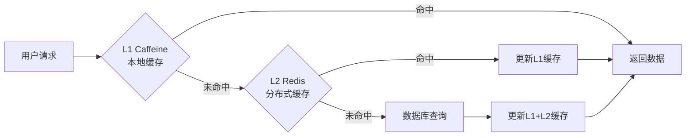

# 用户服务开发文档

## 项目概述

用户服务 (user-service) 是云商城微服务架构中的核心业务服务，负责用户账户管理、权限控制、个人资料维护等功能，采用多级缓存策略提升性能。

### 主要功能

- 用户账户管理 (注册、登录、注销)
- 个人资料管理 (头像上传、信息修改)
- 权限和角色管理
- 多角色支持 (用户、商户、管理员)
- 用户事件消息发布
- 头像文件存储 (MinIO集成)

## 技术栈

### 核心框架

- **Spring Boot**: 3.5.3
- **Spring Cloud**: 2025.0.0
- **Spring Cloud Alibaba**: 2025.0.0.0-preview
- **Spring Security OAuth2**: 资源服务器
- **Java版本**: 17 LTS

### 依赖版本

```xml
<spring-boot.version>3.5.3</spring-boot.version>
<spring-cloud.version>2025.0.0</spring-cloud.version>
<spring-cloud-alibaba.version>2025.0.0.0-preview</spring-cloud-alibaba.version>
<java.version>17</java.version>
<mybatis-plus.version>3.5.13</mybatis-plus.version>
```

### 数据存储

- **MySQL**: 8.0+ (用户信息存储，数据库: user_db)
- **Redis**: 7.0+ (L2分布式缓存，数据库2)
- **Caffeine**: L1本地缓存 (30分钟/2小时策略)
- **MinIO**: 对象存储 (头像文件，端口: 9000)
- **RocketMQ**: 5.3.2 (用户事件消息，端口: 9876)

## 多级缓存架构

### 缓存策略

用户服务采用 **L1(Caffeine) + L2(Redis)** 多级缓存策略：

- **L1 本地缓存**: 30分钟 TTL，高频热点数据
- **L2 分布式缓存**: 2小时 TTL，集群共享数据
- **缓存穿透**: 数据库查询后更新两级缓存
- **缓存雪崩**: 随机化过期时间，避免同时失效



### 缓存配置

```yaml
spring:
  data:
    redis:
      host: localhost
      port: 6379
      password: root
      database: 2  # 用户服务专用Redis数据库
      timeout: 10000ms
      lettuce:
        pool:
          max-active: 8
          max-wait: -1ms
```

## 服务配置

### 服务基本信息

- **服务名称**: user-service
- **运行端口**: 8081
- **数据库**: user_db (MySQL)
- **Redis数据库**: 2 (用户缓存专用)
- **认证方式**: OAuth2.1 JWT
- **文件存储**: MinIO (头像上传)

### 关键配置

```yaml
server:
  port: 8081

spring:
  application:
    name: user-service
  datasource:
    driver-class-name: com.mysql.cj.jdbc.Driver
    url: jdbc:mysql://localhost:3306/user_db?useUnicode=true&characterEncoding=utf8&zeroDateTimeBehavior=convertToNull&useSSL=true&serverTimezone=GMT%2B8
    username: root
    password: root
  security:
    oauth2:
      resourceserver:
        jwt:
          jwk-set-uri: http://127.0.0.1:80/.well-known/jwks.json
          cache-duration: PT30M
  servlet:
    multipart:
      max-file-size: 10MB      # 头像文件大小限制
      max-request-size: 10MB
      enabled: true

# MinIO 对象存储配置
minio:
  endpoint: http://localhost:9000
  access-key: minioadmin
  secret-key: minioadmin
  bucket-name: user-avatars
  public-endpoint: http://localhost:9000
```

## 数据库设计

### 用户信息表 (users)

```sql
CREATE TABLE `users` (
  `id` bigint NOT NULL AUTO_INCREMENT COMMENT '用户ID',
  `username` varchar(50) NOT NULL COMMENT '用户名',
  `email` varchar(100) UNIQUE COMMENT '邮箱地址',
  `phone` varchar(20) UNIQUE COMMENT '手机号码',
  `nickname` varchar(50) COMMENT '昵称',
  `avatar_url` varchar(255) COMMENT '头像URL',
  `gender` tinyint DEFAULT 0 COMMENT '性别：0-未知，1-男，2-女',
  `birthday` date COMMENT '生日',
  `province` varchar(50) COMMENT '省份',
  `city` varchar(50) COMMENT '城市',
  `address` varchar(255) COMMENT '详细地址',
  `status` tinyint NOT NULL DEFAULT 1 COMMENT '状态：0-禁用，1-启用',
  `user_type` tinyint NOT NULL DEFAULT 1 COMMENT '用户类型：1-普通用户，2-商户，3-管理员',
  `registration_source` varchar(20) DEFAULT 'WEB' COMMENT '注册来源',
  `last_login_time` datetime COMMENT '最后登录时间',
  `last_login_ip` varchar(50) COMMENT '最后登录IP',
  `created_time` datetime NOT NULL DEFAULT CURRENT_TIMESTAMP,
  `updated_time` datetime NOT NULL DEFAULT CURRENT_TIMESTAMP ON UPDATE CURRENT_TIMESTAMP,
  `deleted` tinyint NOT NULL DEFAULT 0 COMMENT '逻辑删除',
  `version` bigint NOT NULL DEFAULT 1 COMMENT '乐观锁版本号',
  PRIMARY KEY (`id`),
  UNIQUE KEY `uk_username` (`username`),
  UNIQUE KEY `uk_email` (`email`),
  UNIQUE KEY `uk_phone` (`phone`),
  KEY `idx_user_type` (`user_type`),
  KEY `idx_status` (`status`)
) ENGINE=InnoDB DEFAULT CHARSET=utf8mb4 COMMENT='用户信息表';
```

### 用户角色表 (user_roles)

```sql
CREATE TABLE `user_roles` (
  `id` bigint NOT NULL AUTO_INCREMENT,
  `user_id` bigint NOT NULL COMMENT '用户ID',
  `role_id` bigint NOT NULL COMMENT '角色ID',
  `created_time` datetime NOT NULL DEFAULT CURRENT_TIMESTAMP,
  `deleted` tinyint NOT NULL DEFAULT 0,
  PRIMARY KEY (`id`),
  UNIQUE KEY `uk_user_role` (`user_id`, `role_id`),
  KEY `idx_user_id` (`user_id`),
  KEY `idx_role_id` (`role_id`)
) ENGINE=InnoDB DEFAULT CHARSET=utf8mb4 COMMENT='用户角色关系表';
```

## 用户事件系统

### 支持的事件类型

| 事件类型 | Tag标签 | 触发场景 | 说明 |
|----------|---------|----------|------|
| USER_REGISTERED | user-registered | 用户注册成功 | 新用户注册完成 |
| USER_LOGIN | user-login | 用户登录 | 记录登录行为 |
| USER_LOGOUT | user-logout | 用户登出 | 记录登出行为 |
| USER_UPDATED | user-updated | 用户信息更新 | 个人资料修改 |
| PASSWORD_CHANGED | password-changed | 密码修改 | 安全相关操作 |
| AVATAR_UPDATED | avatar-updated | 头像更新 | 头像上传成功 |
| USER_STATUS_CHANGED | user-status-changed | 用户状态变更 | 启用/禁用用户 |

### 事件生产者配置

```yaml
spring:
  cloud:
    stream:
      rocketmq:
        binder:
          name-server: 127.0.0.1:9876
      bindings:
        user-producer-out-0:
          destination: user-events
          content-type: application/json
          group: user-producer-group
```

## API设计

### 用户管理接口

#### 基础用户接口
- **GET** `/api/user/profile` - 获取当前用户信息
- **PUT** `/api/user/profile` - 更新用户资料
- **POST** `/api/user/avatar` - 上传头像
- **PUT** `/api/user/password` - 修改密码
- **GET** `/api/user/addresses` - 获取用户地址列表

#### 管理员接口
- **GET** `/api/user/admin/users` - 分页查询用户列表
- **PUT** `/api/user/admin/users/{id}/status` - 修改用户状态
- **GET** `/api/user/admin/users/{id}` - 查询用户详情
- **DELETE** `/api/user/admin/users/{id}` - 删除用户

#### 商户接口
- **POST** `/api/user/merchant/register` - 商户注册申请
- **GET** `/api/user/merchant/profile` - 获取商户信息
- **PUT** `/api/user/merchant/profile` - 更新商户资料

### 权限控制

使用 Spring Security 方法级权限控制：

```java
@RestController
@RequestMapping("/api/user")
@PreAuthorize("hasRole('USER')")
public class UserController {
    
    @GetMapping("/profile")
    @PreAuthorize("hasAuthority('user.read')")
    public Result<UserVO> getProfile() {
        // 获取用户信息
    }
    
    @PutMapping("/profile")
    @PreAuthorize("hasAuthority('user.write')")
    public Result<Void> updateProfile(@Valid @RequestBody UserUpdateDTO dto) {
        // 更新用户信息，发送USER_UPDATED事件
    }
    
    @PostMapping("/avatar")
    @PreAuthorize("hasAuthority('user.write')")
    public Result<String> uploadAvatar(@RequestParam("file") MultipartFile file) {
        // 上传头像到MinIO，发送AVATAR_UPDATED事件
    }
}
```

## MinIO 文件存储

### 头像上传流程

1. **文件验证**: 检查文件大小(≤10MB)、格式(jpg/png/gif)
2. **文件上传**: 上传到MinIO的`user-avatars`存储桶
3. **URL生成**: 生成可公开访问的文件URL
4. **数据库更新**: 更新用户表中的头像字段
5. **缓存刷新**: 清除用户缓存，确保数据一致性
6. **事件发布**: 发送AVATAR_UPDATED事件

```java
@Service
public class AvatarService {
    
    public String uploadAvatar(Long userId, MultipartFile file) {
        // 1. 验证文件
        validateFile(file);
        
        // 2. 生成文件名
        String fileName = generateFileName(userId, file);
        
        // 3. 上传到MinIO
        String fileUrl = minioService.uploadFile("user-avatars", fileName, file);
        
        // 4. 更新数据库
        userService.updateAvatar(userId, fileUrl);
        
        // 5. 清除缓存
        userCacheService.evictUserCache(userId);
        
        // 6. 发送事件
        userEventProducer.sendAvatarUpdatedEvent(userId, fileUrl);
        
        return fileUrl;
    }
}
```

## 监控和运维

### 关键监控指标

- 用户注册成功率
- 用户登录成功率
- 头像上传成功率
- 缓存命中率 (L1/L2)
- 数据库连接池状态
- MinIO存储使用情况

### 健康检查

```yaml
management:
  endpoints:
    web:
      exposure:
        include: health,metrics,info
  endpoint:
    health:
      show-details: always
  health:
    elasticsearch:
      enabled: false  # 排除ES健康检查
```

### 多角色API文档

系统支持多角色API文档分组：

```yaml
springdoc:
  group-configs:
    - group: 'user'          # 普通用户接口
      paths-to-match: '/**'
      packages-to-scan: com.cloud.user.controller.user
    - group: 'merchant'      # 商户接口
      paths-to-match: '/**'
      packages-to-scan: com.cloud.user.controller.merchant
    - group: 'admin'         # 管理员接口
      paths-to-match: '/**'
      packages-to-scan: com.cloud.user.controller.admin
```

## 测试指南

### API 测试

通过网关统一入口测试：
- **Knife4j文档**: http://localhost/doc.html
- **用户组接口**: 选择"用户服务"分组
- **头像上传测试**: 使用Postman上传文件

### 缓存测试

1. **L1缓存验证**: 同一JVM实例内重复请求，观察日志
2. **L2缓存验证**: 不同实例间数据共享
3. **缓存穿透测试**: 查询不存在的用户ID
4. **缓存更新测试**: 修改用户信息后验证缓存一致性

### 事件消息测试

1. **注册事件**: 注册新用户，检查log-service是否收到USER_REGISTERED事件
2. **更新事件**: 修改用户信息，验证USER_UPDATED事件发送
3. **头像事件**: 上传头像，确认AVATAR_UPDATED事件生成

## 故障排查

### 常见问题

1. **缓存不一致**:
   - 检查Redis连接状态
   - 验证缓存键命名规范
   - 确认缓存过期时间设置

2. **文件上传失败**:
   - 验证MinIO服务状态
   - 检查存储桶权限配置
   - 确认文件大小限制

3. **权限验证失败**:
   - 确认JWT令牌有效性
   - 检查用户角色和权限配置
   - 验证@PreAuthorize注解配置

4. **事件消息丢失**:
   - 检查RocketMQ连接状态
   - 验证消息生产者配置
   - 查看消息队列积压情况

---

**更新时间**: 2025/9/23  
**版本**: v1.0.0  
**更新内容**: 用户服务完整实现文档，包含多级缓存、事件系统、文件存储、权限控制等
